# ApisnixPhone — user guide

ApisnixPhone is your business phone in the browser: nothing to install, you
open the page, sign in and call.

The screenshots in this guide come from the demonstration: names and numbers
are fictional. Version described: ApisnixPhone Web 0.1.0.

<!-- English edition of GUIDE_UTILISATEUR.md (the French reference): keep both
aligned. PDF layout is set in the image titles, whose words stay French for
the build script: "gauche" (left), "droite" (right), an optional height. -->

## Before you start

- A computer with an up-to-date **Chrome or Edge** and a stable connection.
  Safari can make calls but is not recommended: its sound cues are unreliable.
- A **headset with a microphone**: it makes the quality of your calls.
- Your **username** and **password**, or a **sign-in link**, given by your
  administrator.
- Keep the tab open and the computer awake: if the page is closed or the PC
  goes to sleep, you no longer receive calls.

## 1. Sign in

Open [https://apisnix-crm.com](https://apisnix-crm.com) and choose the
**SIP login** card, or go straight to
[https://phone.apisnix-crm.com](https://phone.apisnix-crm.com).

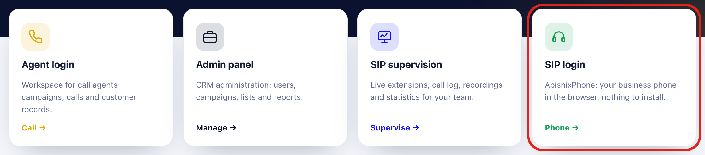

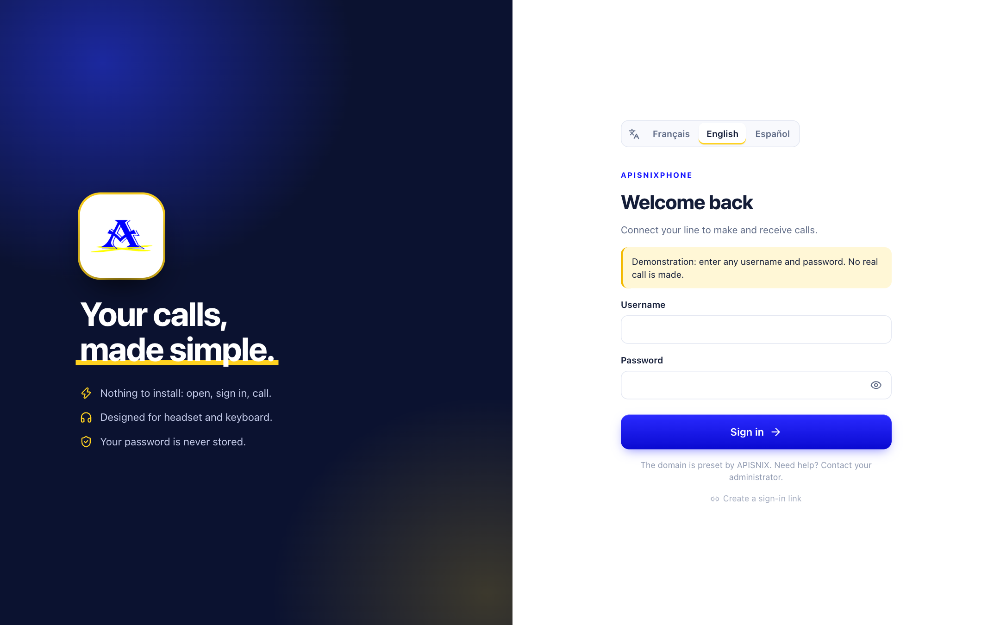

At the top of the form, choose your **language**: Français, English or
Español. The browser remembers it; you can also change it in Settings →
Appearance. Then enter your username and password, and click **Sign in**.
ApisnixPhone never stores your password. Your browser may offer to save it:
if you accept, reloading the page signs you back in by itself (Chrome, Edge)
or fills in the form (Safari). **Decline on a shared computer.**
Received a **sign-in link**? Click it: the line connects by itself, with nothing
to type. It contains your password: do not share it.

| Message | What to do |
| --- | --- |
| Username or password refused | Check what you typed (capitals, zeros). The app does not retry by itself. |
| Cannot connect to the server | Check your network, then try again. |
| This line is already open in another tab | Close the other ApisnixPhone tab. If you have just signed out in this tab, reload the page. |

A chime sounds and the green **Line ready** badge appears: you can call. On
the first call, the browser asks for access to the **microphone**: choose
**Allow**. Refused by mistake? Settings → Audio → **Allow the microphone** asks
again, or explains how to unblock it if the browser remembered the refusal.

## 2. The main screen

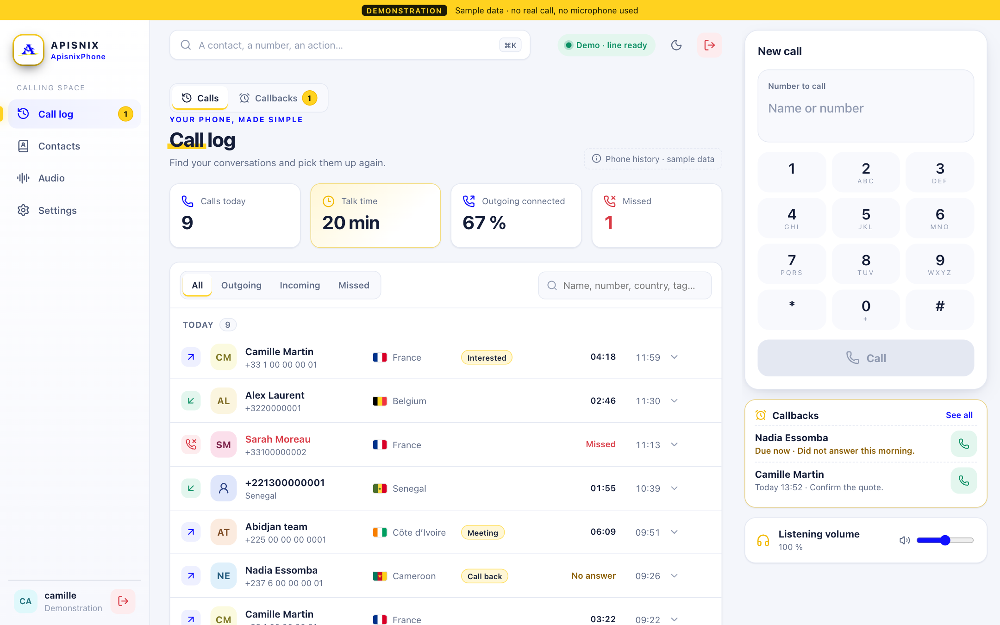

- **On the left**, the menu: Call log, Contacts, Audio, Settings. Callbacks
  are in the Call log, under the **Callbacks** tab. Your account and the red
  **Sign out** button are at the bottom; the same button is at the top right.
- **In the middle**, the chosen page.
- **On the right**, the phone. It stays there whatever the page: you can check
  your callbacks or recordings without leaving your call.
- **At the top**, the search bar and the line status.

## 3. Make a call

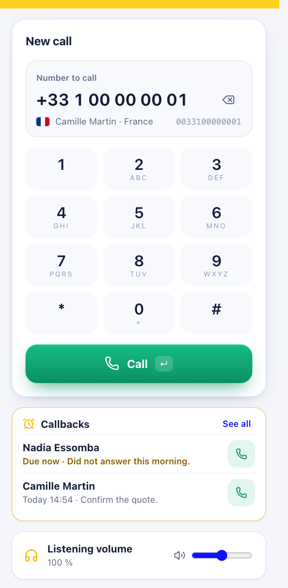

Type the number on the computer keyboard or on the keypad, then **Call** or
the **Enter** key. You can also type a **name**: matching contacts are
suggested.

**A leading `+` is accepted**: `+33` becomes `0033`; for other country codes,
only `+` is removed. The grey line shows the number actually dialled.
The country stays visible. Your line’s routing prefixes are still required.
To enter a `+`, hold **0**.

Each key of the keypad plays a short tone, like a classic phone. To turn it
off: Settings → Audio, **Keypad sounds**.

A classic “beep beep” tone plays while it rings, then a short chime confirms
the answer. The timer starts then, never while waiting; before that, the red
button reads **Cancel**.

## 4. During the call

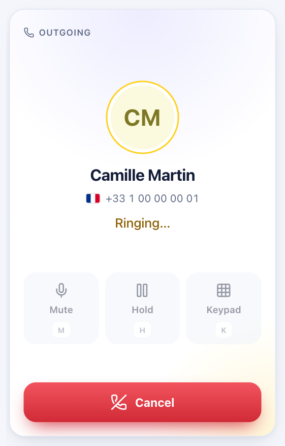 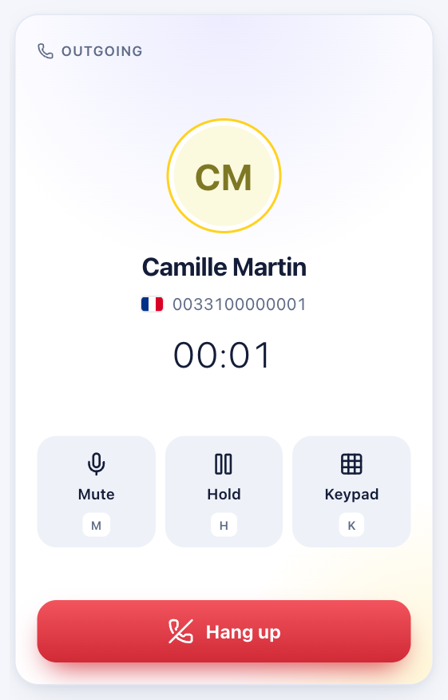 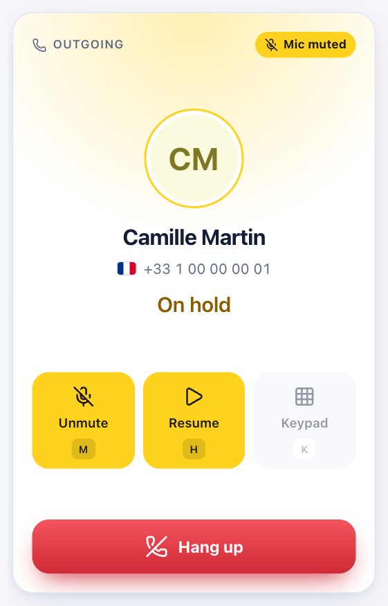

- **Mute** (`M` key) turns off your microphone: the other person no longer
  hears you. A yellow “Mic muted” label reminds you.
- **Hold** (`H`) puts the other person on hold; **Resume** takes the call
  back.
- **Keypad** (`K`, or the digits) sends keys to a voice menu (“press 1…”).
- **Hang up** ends the call.

Shortcuts do not work while you are typing in a field, and the Esc key never
hangs up.

## 5. At the end of the call

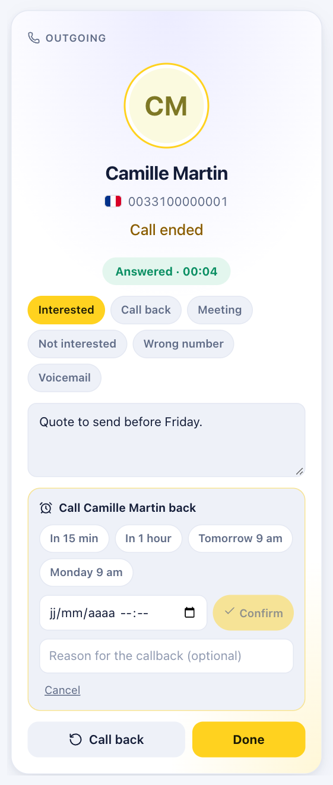

The app shows the outcome and the duration. In a few seconds, you can:

- **tag** the call with one or more tags (Interested, Call back, Meeting…);
- write a **note**;
- **schedule a callback**: “In 15 min”, “In 1 hour”, “Tomorrow 9 am”,
  “Monday 9 am” or an exact date, with an optional reason;
- **Call back** right away, **Add** the number to your contacts, or click
  **Done**. Calling someone else from the Call log, Contacts or Callbacks
  also closes this card: nothing is lost, tags and note are already saved.

If a call fails, because of the microphone or a refusal by the server, a red
box gives the reason. If it happens again, pass the code shown on to your
administrator: it stays visible in the call's details in the **Call log**.

## 6. Receive a call

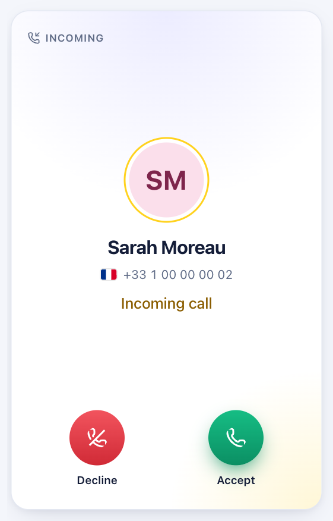

The phone rings with the ringtone chosen in Settings, comes to the front and
the tab title shows “Incoming call…”.

Choose **Accept** or **Decline**: the app never answers for you.

A call left unanswered becomes **Missed** and a red badge appears on the Call
log; it clears when you open it.

## 7. The call log

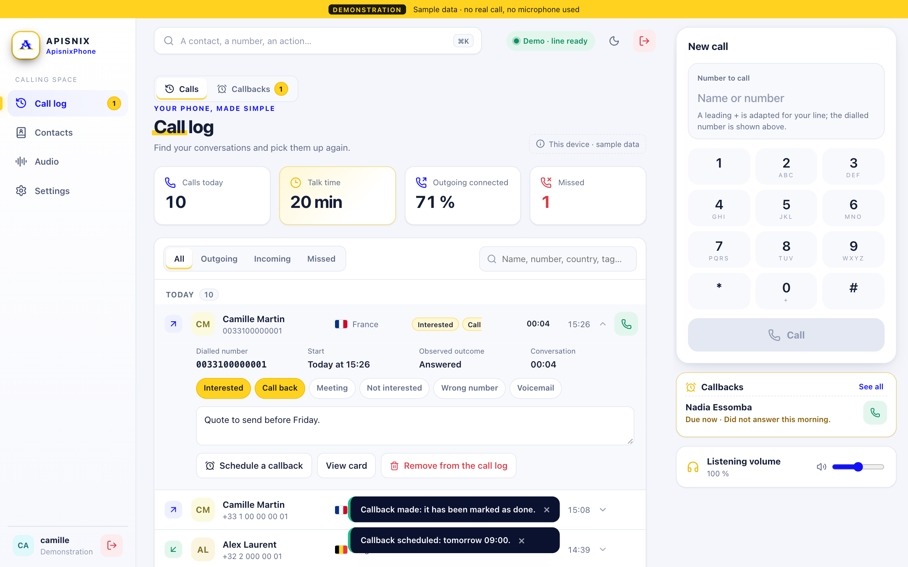

Calls are grouped by day. Filter by **All / Outgoing / Incoming / Missed** or
search for a name, a number or a country. The call-back button calls again; a
click on the row opens its details.

- **All calls of the extension**: the last 30 days, including calls made from
  another device. Refreshed every minute.
- **This device**: calls seen by this browser, with your tags and notes.

## 8. Callbacks

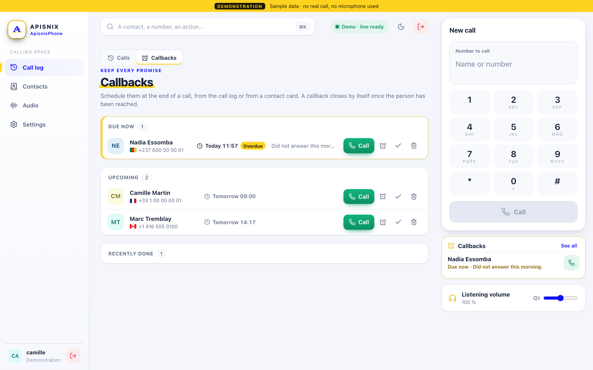

Open **Call log**, then **Callbacks**. Your callbacks are sorted into **Due
now**, **Later today** and **Upcoming**. At the set time, the app reminds you
and a yellow badge appears.

For each callback: **Call**, postpone by one hour, mark as done or delete.
**A callback closes by itself as soon as you have reached the person.**

## 9. Your recordings

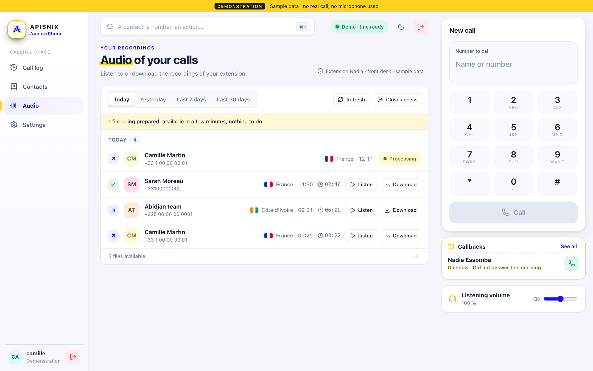

The **Audio** page gathers the recordings of your extension's calls. They
appear **a few minutes after the call ends** (“Processing” until then).

Choose Today, Yesterday, Last 7 or **Last 30 days**, then **Listen** in the page or **Download** the file. You
only see the recordings of your own extension.

Nothing to type: access opens with your line. If it fails, **Try again**;
otherwise, contact APISNIX.

## 10. Settings

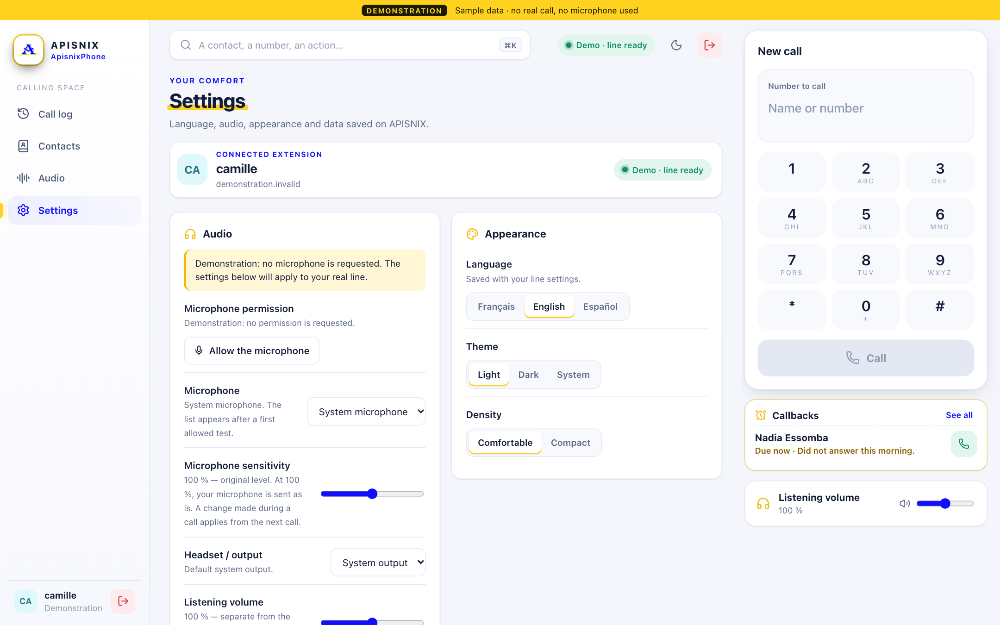

- **Connected extension**: at the top of the page, your line's username, its
  server and its status. On a phone this is where you read it; a screenshot
  of this screen tells support which extension is connected.
- **Audio**: microphone permission and choice of microphone and headset,
  **microphone sensitivity**, **Test the microphone**, echo cancellation,
  noise reduction, line and keypad sounds.
- **Listening volume**: 100 % by default, up to **200 %** if the other person
  is still too quiet. Above 100 %, prefer a headset to avoid echo.
- **Appearance**: language (Français, English, Español), Light, Dark or
  System theme, display density.
- **Calls**: system notifications, useful if you often work in another
  window.

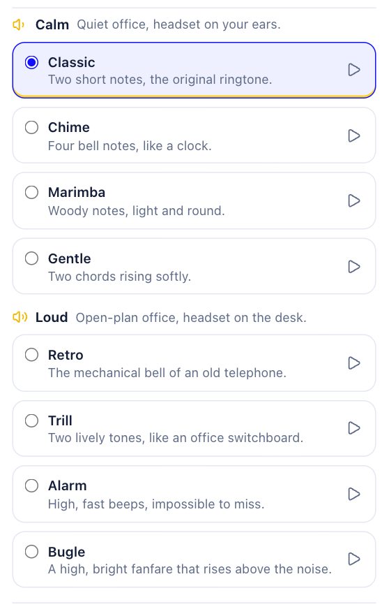

- **Ringtone**: eight sounds. The **calm** ones (Classic, Chime, Marimba,
  Gentle) for a quiet office; the **loud** ones (Retro, Trill, Alarm, Bugle)
  for an open-plan office. Tap a sound to choose it; ▶ plays it without
  choosing it.
- **Data on this device**: by default, contacts, notes and the local call log
  are erased when you sign out. **Keep on this device** keeps them: **never on
  a shared computer.**
- **Account**: your username, the version, **Sign out**.

## 11. On a phone or a small window

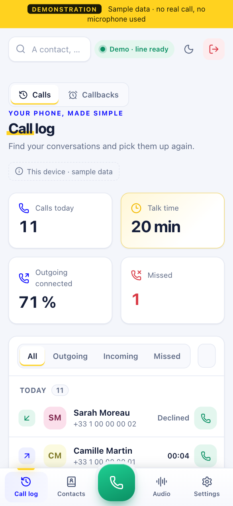 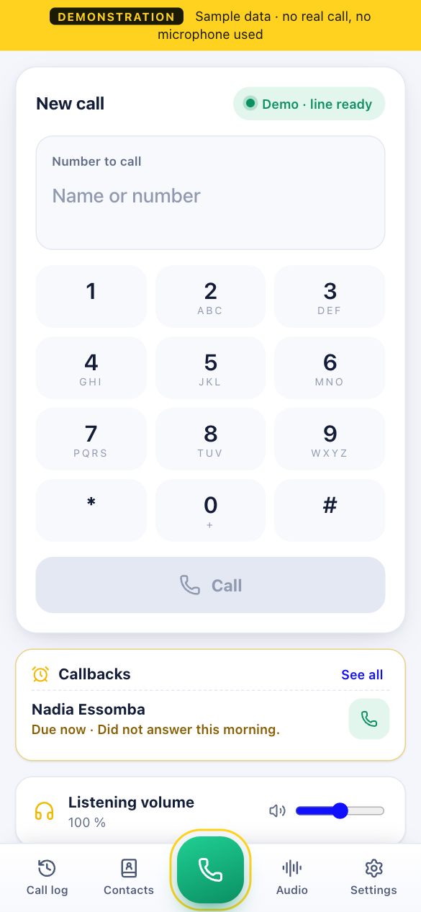

The menu moves to the bottom of the screen, with the green **Phone** button
and **Audio** always visible.

During a call, a banner stays visible on every page, with its **Hang up**
button.

## Troubleshooting

| What you see | What to do |
| --- | --- |
| “This line is open on another device” | **One account = one device at a time**: this phone is paused. **Take the line back here** gets it back. If it is not you, tell your administrator. |
| “Connection lost”, “Call interrupted” or two falling notes | The network dropped. Wait a few seconds, check your network and call again: a call is **never** redialled automatically. |
| Display stuck | Outside a call, open [manual sign-in](https://phone.apisnix-crm.com/?connexion=manuelle). Your saved data is kept. |
| “The microphone is blocked” | Settings → Audio → **Microphone permission**, or the icon to the left of the address → Microphone → Allow. |
| “No microphone found” | Plug the headset back in, then check Settings → Audio. |
| “Turn on sound” button | Click it: the browser had blocked the sound. |
| You are hard to hear, choppy voice | Often the Wi-Fi: move closer to the router or use a cable. |

## Good to know

- Closing the tab or reloading the page during a call **ends the call**.
- The flag shows the country of the **number**, not where the person is. A
  received number without a reliable country code has an unknown country.
- For any question about your account or your calling rights, contact your
  APISNIX administrator.
