# ApisnixPhone — guía de uso

ApisnixPhone es tu teléfono profesional en el navegador: nada que instalar,
abres la página, inicias sesión y llamas.

Las capturas de esta guía proceden de la demostración: los nombres y números
son ficticios. Versión descrita: ApisnixPhone Web 0.1.0.

<!-- Edición española de GUIDE_UTILISATEUR.md (referencia en francés): mantener
ambas alineadas. La maquetación del PDF se fija en los títulos de las imágenes,
cuyas palabras siguen en francés para el script: "gauche" (izquierda),
"droite" (derecha), una altura opcional. -->

## Antes de empezar

- Un ordenador con **Chrome o Edge** actualizado y una conexión estable.
  Safari permite llamar, pero no se recomienda: sus avisos sonoros no son
  fiables.
- Unos **auriculares con micrófono**: de ellos depende la calidad de tus
  llamadas.
- Tu **usuario** y tu **contraseña**, o un **enlace de conexión**, entregados
  por tu administrador.
- Mantén la pestaña abierta y el ordenador encendido: si la página se cierra o
  el PC entra en reposo, dejas de recibir llamadas.

## 1. Iniciar sesión

Abre [https://apisnix-crm.com](https://apisnix-crm.com) y elige la tarjeta
**Conexión SIP**, o ve directamente a
[https://phone.apisnix-crm.com](https://phone.apisnix-crm.com).

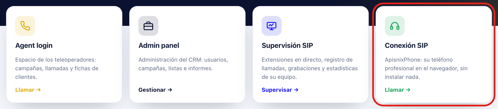

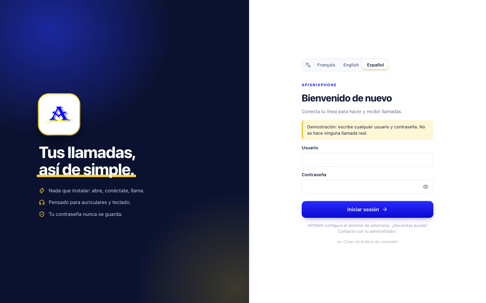

En la parte superior del formulario, elige tu **idioma**: Français, English o
Español. El navegador lo recuerda; también se cambia en Ajustes → Apariencia.
Después escribe tu usuario y tu contraseña y pulsa **Iniciar sesión**.
ApisnixPhone nunca guarda tu contraseña. Tu navegador puede ofrecerte
recordarla: si aceptas, al recargar la página vuelves a conectarte solo
(Chrome, Edge) o el formulario se rellena (Safari). **Recházalo en un
ordenador compartido.**
¿Recibiste un **enlace de conexión**? Haz clic en él: la línea se conecta sola,
sin escribir nada. Contiene tu contraseña: no lo compartas.

| Mensaje | Qué hacer |
| --- | --- |
| Usuario o contraseña rechazados | Revisa lo que escribiste (mayúsculas, ceros). La aplicación no lo reintenta sola. |
| No se puede conectar con el servidor | Comprueba tu red y vuelve a intentarlo. |
| Esta línea ya está abierta en otra pestaña | Cierra la otra pestaña de ApisnixPhone. Si acabas de cerrar sesión en esta pestaña, recarga la página. |

Suena un carillón y aparece la etiqueta verde **Línea lista**: ya puedes
llamar. En la primera llamada, el navegador pide acceso al **micrófono**: elige
**Permitir**. ¿Lo rechazaste por error? Ajustes → Audio → **Permitir el
micrófono** lo vuelve a pedir, o explica cómo desbloquearlo si el navegador
recordó el rechazo.

## 2. La pantalla principal

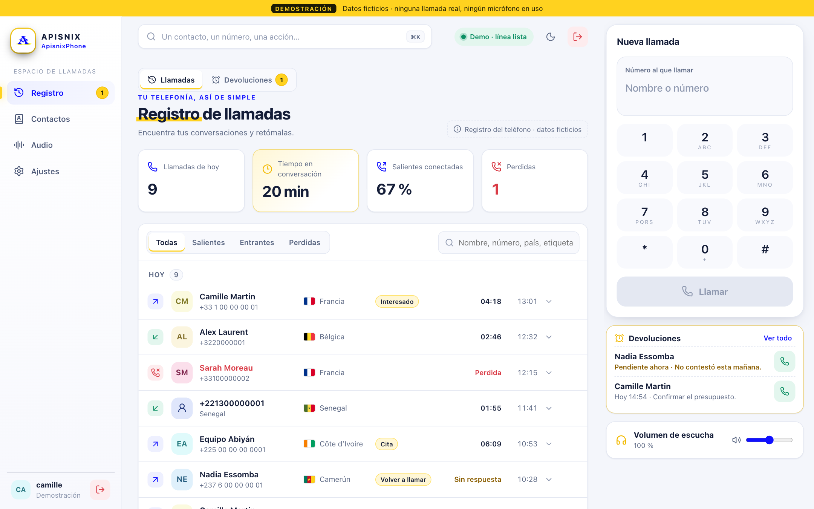

- **A la izquierda**, el menú: Registro, Contactos, Audio, Ajustes. Las
  devoluciones de llamada están en el Registro, en la pestaña
  **Devoluciones**. Tu cuenta y el botón rojo **Cerrar sesión** están abajo; el
  mismo botón está arriba a la derecha.
- **En el centro**, la página elegida.
- **A la derecha**, el teléfono. Permanece ahí sea cual sea la página: puedes
  consultar tus devoluciones o tus grabaciones sin dejar la llamada.
- **Arriba**, la barra de búsqueda y el estado de la línea.

## 3. Hacer una llamada

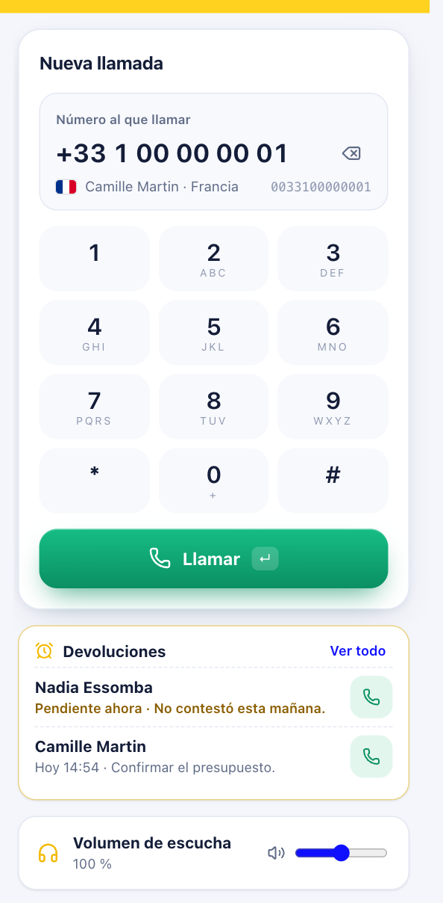

Escribe el número con el teclado del ordenador o en el teclado numérico y
pulsa **Llamar** o la tecla **Intro**. También puedes escribir un **nombre**:
se proponen los contactos que coinciden.

**El número se marca exactamente como lo escribes**: no se añade ningún
prefijo. La bandera y el país ayudan a leerlo; la línea gris de la derecha
muestra las cifras que se marcarán realmente. Para un `+`, mantén pulsada la
tecla **0**.

Cada tecla emite un tono corto, como en un teléfono clásico. Para quitarlo:
Ajustes → Audio, **Sonidos del teclado**.

Un tono clásico «tuu tuu» acompaña el timbre y un breve carillón confirma que
han contestado. El cronómetro empieza entonces, nunca durante la espera; antes,
el botón rojo indica **Cancelar**.

## 4. Durante la llamada

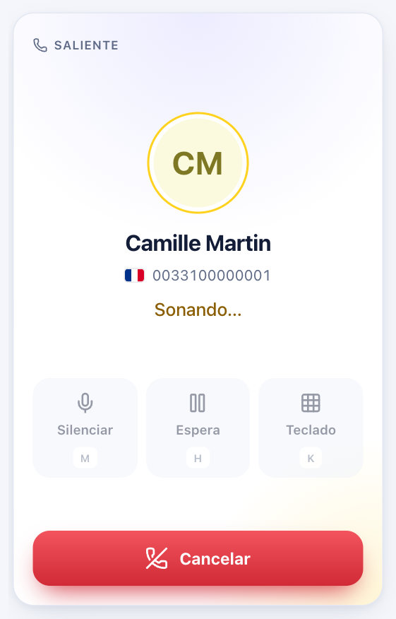 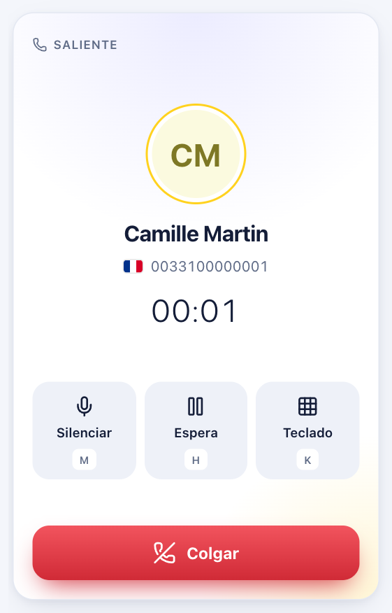 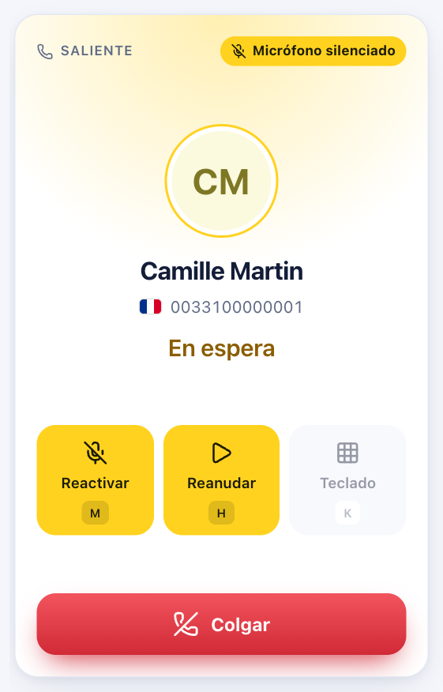

- **Silenciar** (tecla `M`) apaga tu micrófono: tu interlocutor deja de
  oírte. Una etiqueta amarilla «Micrófono silenciado» te lo recuerda.
- **Espera** (`H`) pone a tu interlocutor en espera; **Reanudar** recupera la
  llamada.
- **Teclado** (`K`, o las cifras) envía teclas a un menú de voz («pulse 1…»).
- **Colgar** termina la llamada.

Los atajos no funcionan mientras escribes en un campo, y la tecla Esc nunca
cuelga.

## 5. Al final de la llamada

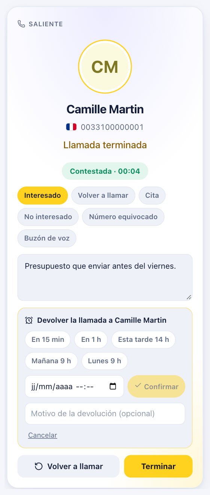

La aplicación indica el resultado y la duración. En pocos segundos puedes:

- **clasificar** la llamada con una o varias etiquetas (Interesado, Volver a
  llamar, Cita…);
- escribir una **nota**;
- **programar una devolución**: «En 15 min», «En 1 h», «Mañana 9 h»,
  «Lunes 9 h» o una fecha concreta, con un motivo opcional;
- **Volver a llamar** enseguida, **Añadir** el número a tus contactos o
  **Terminar**.

Si una llamada falla, por el micrófono o por un rechazo del servidor, un
recuadro rojo indica la causa. Si se repite, comunica a tu administrador el
código mostrado: sigue visible en el detalle de la llamada del **Registro**.

## 6. Recibir una llamada

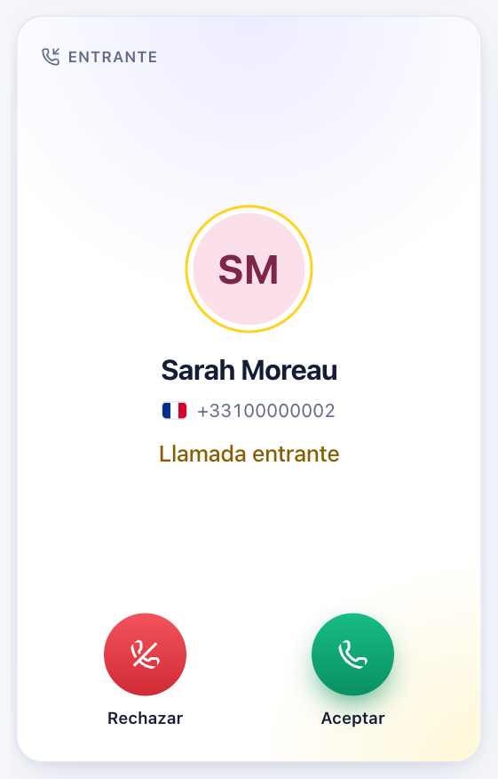

El teléfono suena con el tono elegido en Ajustes, pasa a primer plano y el
título de la pestaña muestra «Llamada entrante…».

Elige **Aceptar** o **Rechazar**: la aplicación nunca contesta por ti.

Una llamada sin respuesta pasa a **Perdida** y aparece una etiqueta roja en el
Registro; desaparece cuando lo abres.

## 7. El registro de llamadas

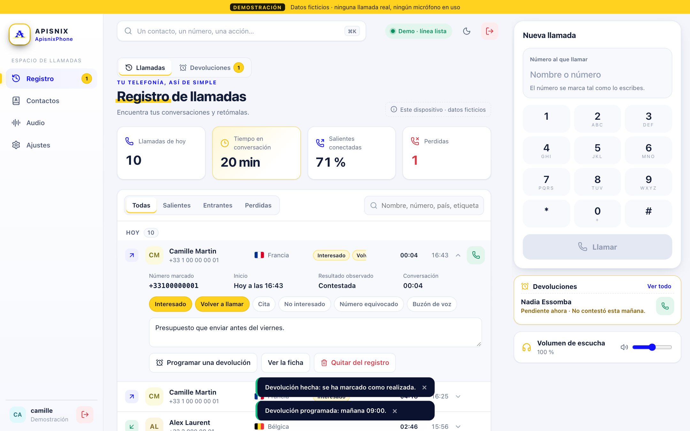

Las llamadas se agrupan por día. Filtra por **Todas / Salientes / Entrantes /
Perdidas** o busca un nombre, un número o un país. El botón de llamada vuelve a
llamar; un clic en la fila abre su detalle.

- **Todas las llamadas de la extensión**: los últimos 30 días, incluidas las
  hechas desde otro dispositivo. Se actualiza cada minuto.
- **Este dispositivo**: las llamadas vistas por este navegador, con tus
  etiquetas y notas.

## 8. Las devoluciones de llamada

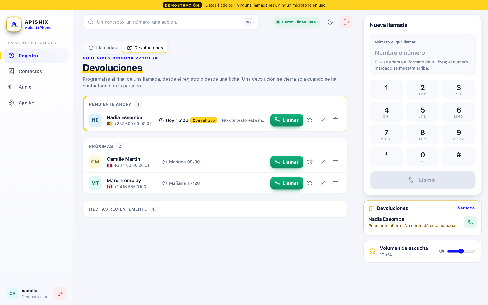

Abre **Registro** y luego **Devoluciones**. Se ordenan en **Pendiente
ahora**, **Más tarde hoy** y **Próximas**. A la hora prevista, la aplicación te
avisa y aparece una etiqueta amarilla.

Para cada devolución: **Llamar**, aplazar una hora, marcar como hecha o
eliminar. **Una devolución se cierra sola en cuanto has hablado con la
persona.**

## 9. Tus grabaciones

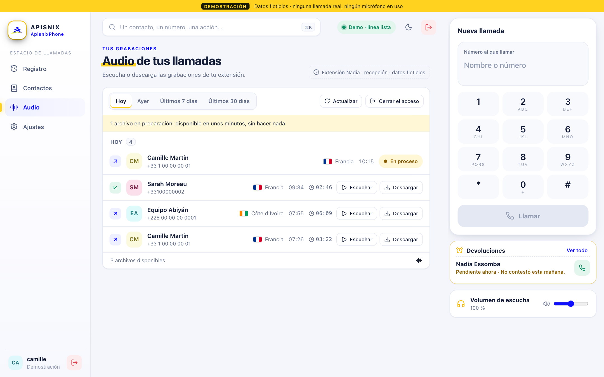

La página **Audio** reúne las grabaciones de las llamadas de tu extensión.
Aparecen **unos minutos después del final de la llamada** («En proceso»
mientras tanto).

Elige el periodo y pulsa **Escuchar** en la página o **Descargar** el archivo.
Solo ves las grabaciones de tu extensión.

Nada que escribir: el acceso se abre con tu línea. Si falla, **Reintentar**;
si no, contacta con APISNIX.

## 10. Ajustes

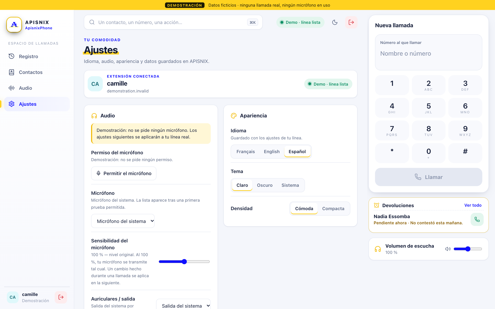

- **Audio**: permiso y elección del micrófono y de los auriculares,
  **sensibilidad del micrófono**, **Probar el micrófono**, cancelación de eco,
  reducción de ruido, sonidos de la línea y del teclado.
- **Volumen de escucha**: 100 % por defecto, hasta **200 %** si tu
  interlocutor sigue oyéndose bajo. Por encima del 100 %, usa auriculares para
  evitar el eco.
- **Apariencia**: idioma (Français, English, Español), tema Claro, Oscuro o
  Sistema, densidad de visualización.
- **Llamadas**: notificaciones del sistema, útiles si sueles trabajar en otra
  ventana.

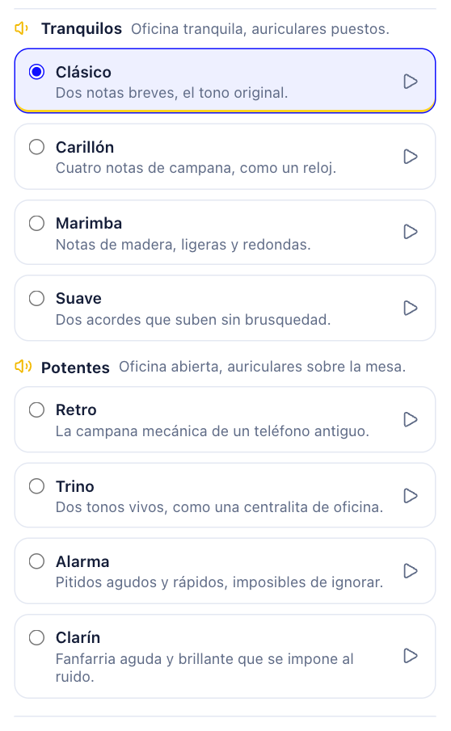

- **Tono de llamada**: ocho sonidos. Los **tranquilos** (Clásico, Carillón,
  Marimba, Suave) para una oficina tranquila; los **potentes** (Retro, Trino,
  Alarma, Clarín) para una oficina abierta. Pulsa un sonido para elegirlo; ▶ lo
  escucha sin elegirlo.
- **Datos de este dispositivo**: por defecto, los contactos, las notas y el
  registro local se borran al cerrar sesión. **Guardar en este dispositivo**
  los conserva: **nunca en un ordenador compartido.**
- **Cuenta**: tu usuario, la versión, **Cerrar sesión**.

## 11. En un teléfono o en una ventana pequeña

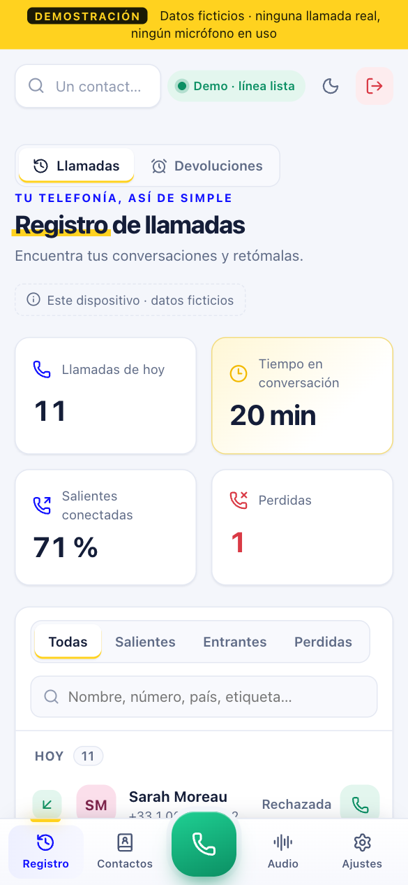 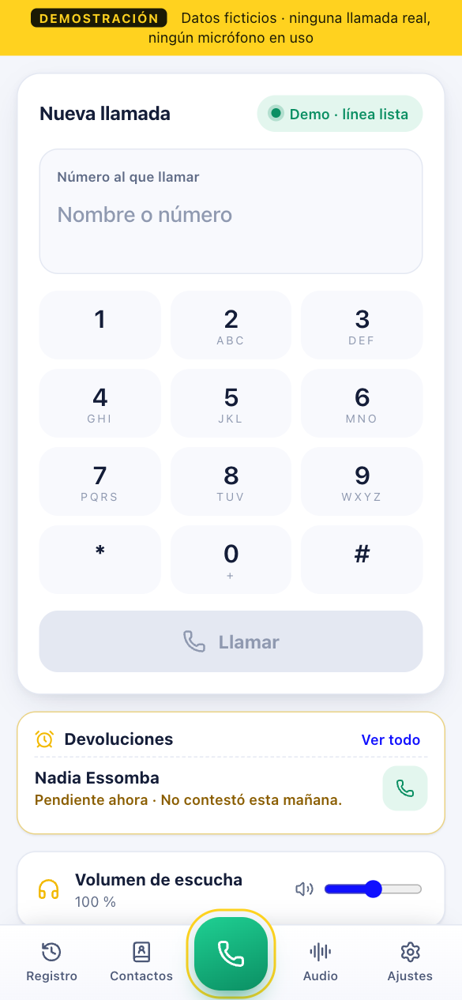

El menú pasa a la parte inferior de la pantalla, con el botón verde
**Teléfono** y el acceso a **Audio** siempre visibles.

Durante una llamada, una franja permanece visible en todas las páginas, con su
botón **Colgar**.

## Si algo falla

| Lo que ves | Qué hacer |
| --- | --- |
| «Esta línea está abierta en otro dispositivo» | **Una cuenta = un solo dispositivo a la vez**: este queda en pausa. **Recuperar la línea aquí** la recupera. Si no has sido tú, avisa a tu administrador. |
| «Conexión perdida», «Llamada interrumpida» o dos notas descendentes | Se cortó la red. Espera unos segundos, comprueba tu red y vuelve a llamar: una llamada **nunca** se repite automáticamente. |
| Espera: «Un momento…» y luego un mensaje | Conexión inestable: vuelve a intentarlo o cambia de red. |
| «El micrófono está bloqueado» | Ajustes → Audio → **Permiso del micrófono**, o el icono a la izquierda de la dirección → Micrófono → Permitir. |
| «No se encontró ningún micrófono» | Vuelve a conectar los auriculares y revisa Ajustes → Audio. |
| Botón «Activar el sonido» | Púlsalo: el navegador había bloqueado el sonido. |
| Se te oye mal, voz entrecortada | A menudo es el wifi: acércate al router o usa un cable. |

## Conviene saber

- Cerrar la pestaña o recargar la página durante una llamada **corta la
  llamada**.
- La bandera indica el país del **número**, no dónde está la persona. Un
  número que empieza por `0` se lee como número francés.
- Para cualquier duda sobre tu cuenta o tus permisos de llamada, contacta con
  tu administrador de APISNIX.
