# ApisnixPhone — guide d'utilisation

ApisnixPhone est votre téléphone professionnel dans le navigateur : rien à
installer, vous ouvrez la page, vous vous connectez, vous appelez.

Les captures de ce guide viennent de la démonstration : noms et numéros sont
fictifs. Version décrite : ApisnixPhone Web 0.1.0.

## Avant de commencer

- Un ordinateur avec **Chrome, Edge ou Safari** à jour, et une connexion stable.
- Un **casque avec micro** : c'est lui qui fait la qualité de vos appels.
- Votre **identifiant** et votre **mot de passe**, remis par votre administrateur.
- Gardez l'onglet ouvert et l'ordinateur éveillé : si la page est fermée ou le
  PC en veille, vous ne recevez plus d'appels.

## 1. Se connecter

Saisissez votre identifiant et votre mot de passe, puis **Se connecter**.
ApisnixPhone n'enregistre jamais votre mot de passe. Votre navigateur peut vous
proposer de le retenir : si vous acceptez, une actualisation de la page vous
reconnecte toute seule (Chrome, Edge) ou préremplit le formulaire (Safari).
**Refusez sur un ordinateur partagé.**

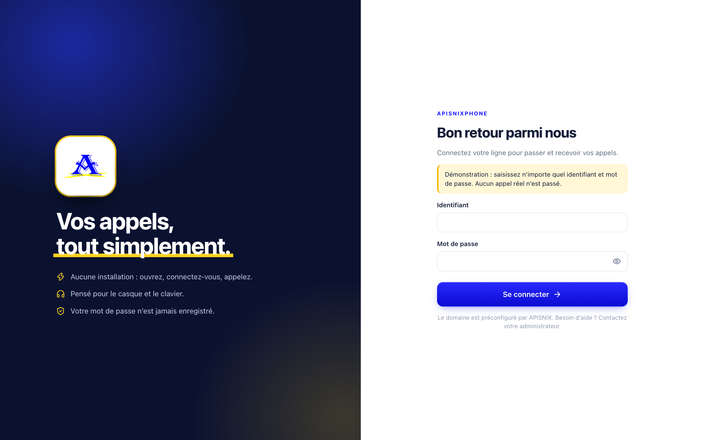

Un carillon retentit et la pastille verte **Ligne prête** apparaît : vous pouvez
appeler. Au premier appel, le navigateur demande l'accès au **microphone** :
choisissez **Autoriser**.

| Message | Que faire |
| --- | --- |
| Identifiant ou mot de passe refusé | Vérifiez la saisie (majuscules, zéros). L'application ne réessaie pas toute seule. |
| Connexion au serveur impossible | Vérifiez votre réseau, puis réessayez. |
| Cette ligne est déjà ouverte dans un autre onglet | Fermez l'autre onglet ApisnixPhone. |

## 2. L'écran principal

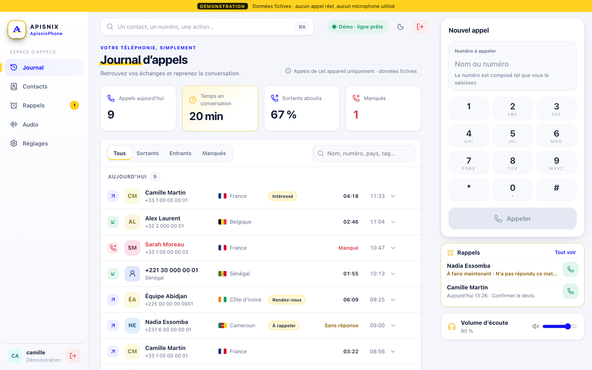

- **À gauche**, le menu : Journal, Contacts, Rappels, Favoris, Réglages. Votre
  compte et le bouton rouge **Se déconnecter** sont en bas ; le même bouton se
  trouve en haut à droite.
- **Au centre**, la page choisie.
- **À droite**, le téléphone. Il reste là quelle que soit la page : vous pouvez
  consulter un contact ou vos rappels sans quitter votre appel.
- **En haut**, la barre de recherche et l'état de la ligne.

## 3. Passer un appel

Tapez le numéro au clavier de l'ordinateur ou sur le pavé, puis **Appeler** ou
la touche **Entrée**. Vous pouvez aussi taper un **nom** : les contacts
correspondants sont proposés.

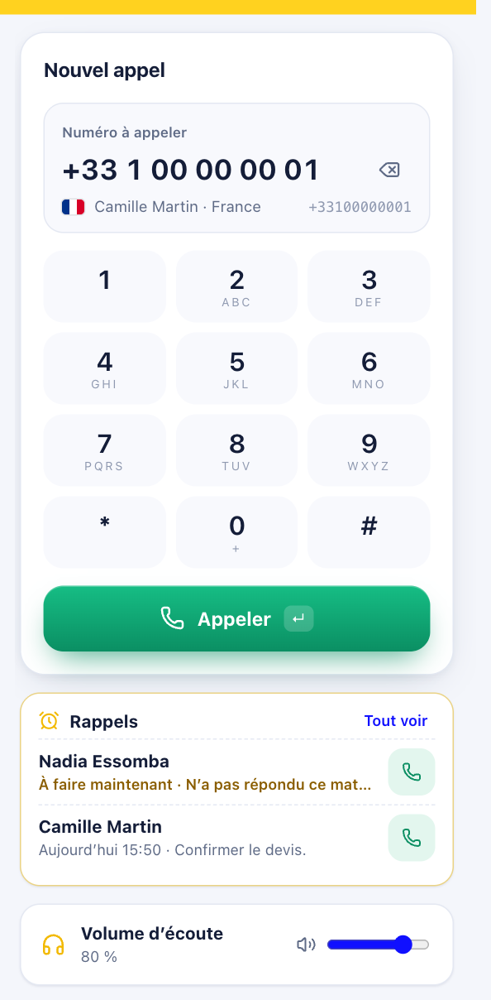

**Le numéro est composé exactement comme vous le saisissez** : aucun indicatif
n'est ajouté. Le drapeau et le pays sont une aide à la lecture ; la ligne grise
à droite montre les chiffres qui partiront réellement. Pour un `+`, maintenez la
touche **0** du pavé.

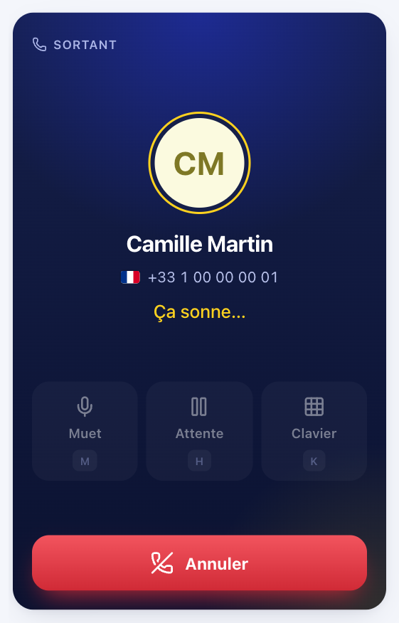

Le chronomètre démarre **quand votre correspondant décroche**, pas pendant la
sonnerie. Avant, le bouton rouge indique **Annuler**.

## 4. Pendant l'appel

| Appel en cours | Micro coupé, appel en attente |
| --- | --- |
| 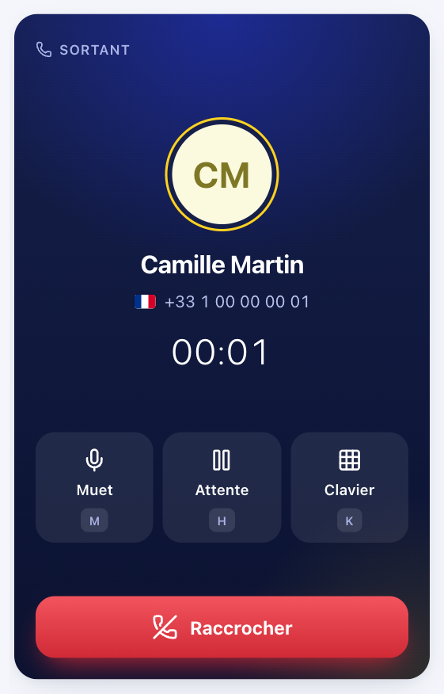 | 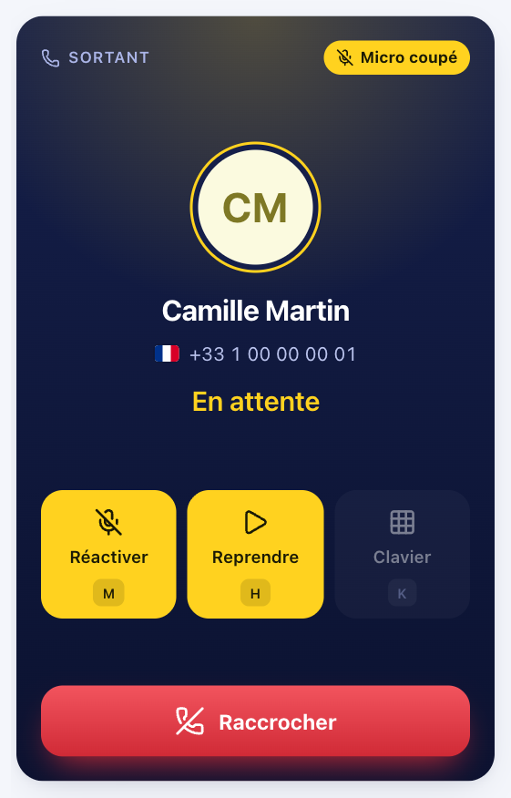 |

| Bouton | Raccourci | Effet |
| --- | --- | --- |
| **Muet** | `M` | Coupe votre micro ; le correspondant ne vous entend plus. Une étiquette jaune « Micro coupé » le rappelle. |
| **Attente** | `H` | Met le correspondant en attente ; **Reprendre** le récupère. L'écran change quand la mise en attente est confirmée. |
| **Clavier** | `K`, ou les chiffres | Envoie des touches à un serveur vocal (« tapez 1… »). |
| **Raccrocher** | — | Termine l'appel. |

Les raccourcis ne fonctionnent pas pendant que vous écrivez dans un champ, et la
touche Échap ne raccroche jamais.

## 5. À la fin de l'appel

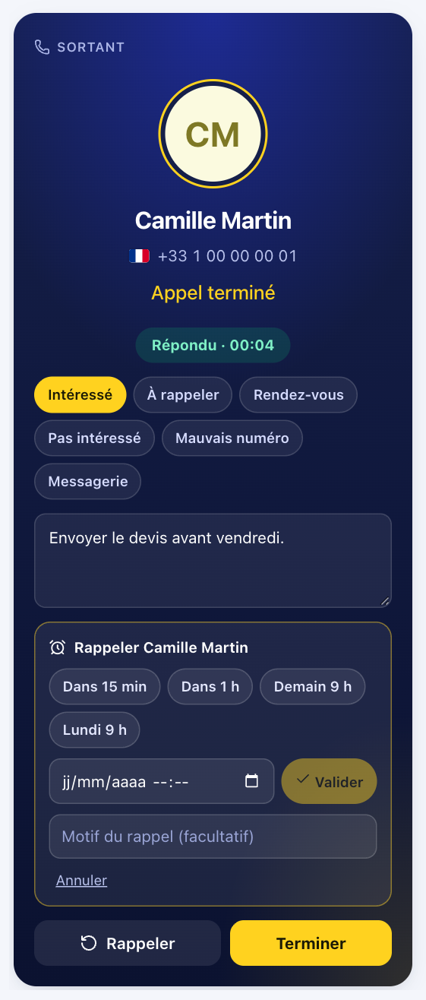

L'application indique l'issue et la durée. Vous pouvez, en quelques secondes :

- **qualifier** l'appel avec un ou plusieurs tags (Intéressé, À rappeler,
  Rendez-vous…) ;
- écrire une **note** ;
- **planifier un rappel** : « Dans 15 min », « Dans 1 h », « Demain 9 h »,
  « Lundi 9 h » ou une date précise, avec un motif facultatif ;
- **Rappeler** tout de suite, **Ajouter** le numéro à vos contacts, ou
  **Terminer**.

Si un appel échoue à cause du micro, un encadré rouge explique quoi faire.

## 6. Recevoir un appel

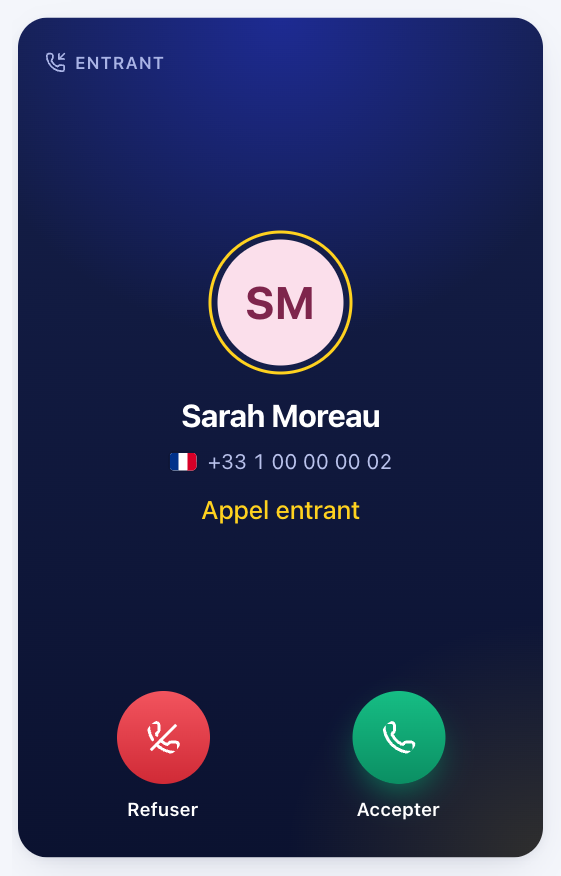

Le téléphone sonne, passe au premier plan et le titre de l'onglet affiche
« Appel entrant… ». Choisissez **Accepter** ou **Refuser** : l'application ne
répond jamais à votre place. Un appel laissé sans réponse devient **Manqué** et
une pastille rouge apparaît sur le Journal ; elle s'efface quand vous l'ouvrez.

## 7. Le journal d'appels

Vos appels sont regroupés par jour. Filtrez par **Tous / Sortants / Entrants /
Manqués** ou cherchez un nom, un numéro, un pays ou un tag. Au survol d'une
ligne, le bouton vert rappelle le numéro. Un clic sur la ligne ouvre le détail :
numéro composé, dates, tags, note, rappel, ajout aux contacts.

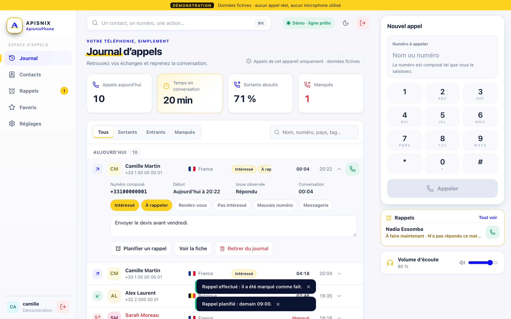

> **« Appels de cet appareil uniquement »** : ce journal contient les appels
> passés et reçus **depuis ce navigateur, sur cet ordinateur**. Les appels faits
> avec le même compte depuis un autre poste ou un autre téléphone n'y figurent
> pas. Les chiffres du haut de page portent sur ce même journal.

## 8. Contacts et favoris

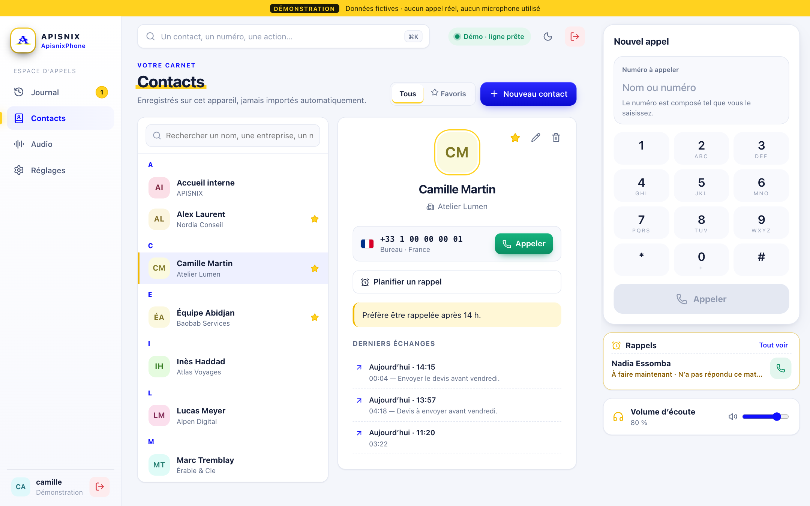

**Nouveau contact** crée une fiche : nom, entreprise, plusieurs numéros avec un
libellé, note. La fiche montre vos derniers échanges avec la personne. L'étoile
l'ajoute aux **Favoris**.

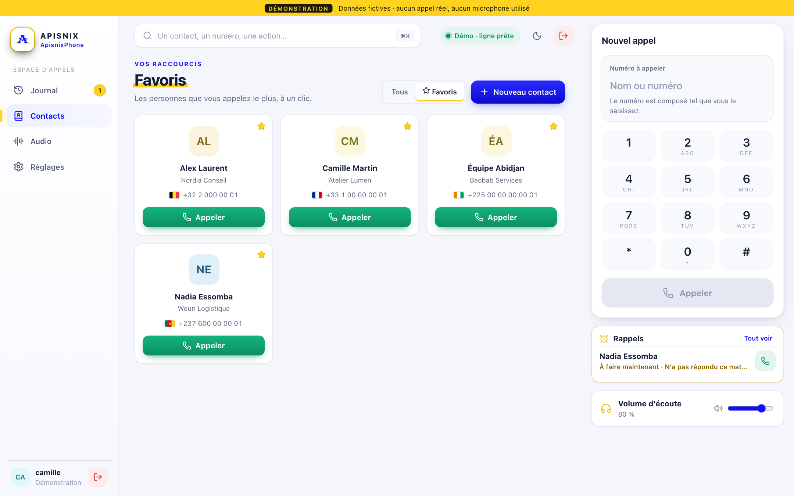

Dans les Favoris, cliquer sur la carte ouvre la fiche ; seul le bouton
**Appeler** lance l'appel, pour éviter tout appel par erreur.

## 9. Les rappels

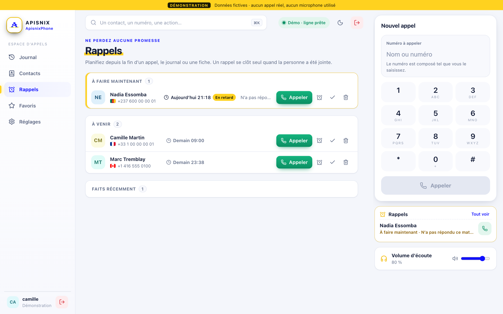

Tout rappel planifié arrive ici, classé : **À faire maintenant**, **Plus tard
aujourd'hui**, **À venir**. À l'heure prévue, l'application vous prévient et une
pastille jaune apparaît. Pour chaque rappel : **Appeler**, reporter d'une heure,
marquer comme fait, supprimer. Les prochains rappels s'affichent aussi sous le
pavé numérique. **Un rappel se clôt tout seul dès que vous avez joint la
personne.**

## 10. Tout trouver en un geste

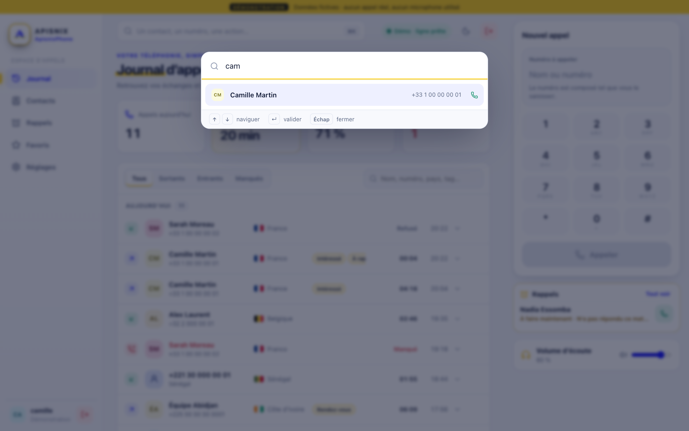

Cliquez sur la barre du haut ou tapez **Ctrl + K** (**⌘ K** sur Mac) : un nom,
un numéro ou une action (« réglages », « thème sombre »…). Flèches pour choisir,
Entrée pour valider.

## 11. Réglages

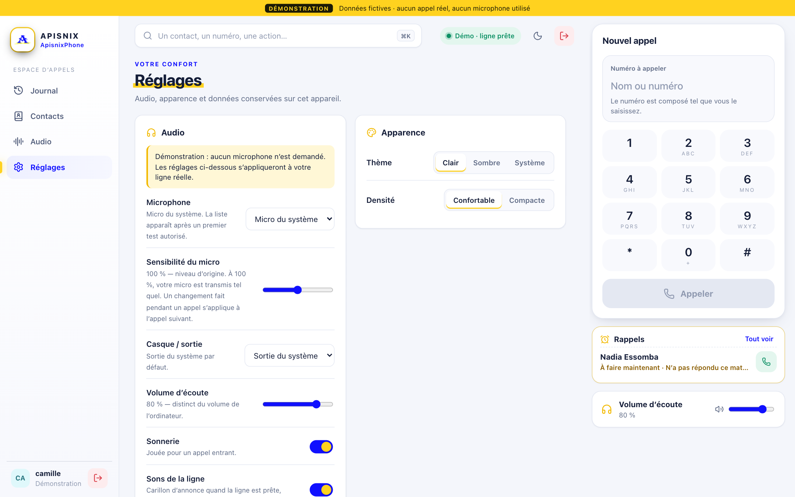

- **Audio** : choix du micro et du casque, **sensibilité du micro** (si l'on vous
  entend trop faible ou trop fort — modifiable pendant un appel), **volume
  d'écoute**, **Tester le micro** avec une barre de niveau, sonnerie, sons de la
  ligne, annulation d'écho, réduction de bruit.
- **Apparence** : thème Clair, Sombre ou Système ; densité d'affichage.
- **Appels** : notifications du système, à activer si vous travaillez souvent
  dans une autre fenêtre.
- **Données de cet appareil** : par défaut, contacts, notes et journal
  disparaissent à la déconnexion. Activez **Conserver sur cet appareil** pour les
  retrouver la prochaine fois. **Ne l'activez pas sur un ordinateur partagé.**
  « Effacer les données de cet appareil » supprime tout ce qui est conservé ici.
- **Compte** : votre identifiant, la version, **Se déconnecter**.

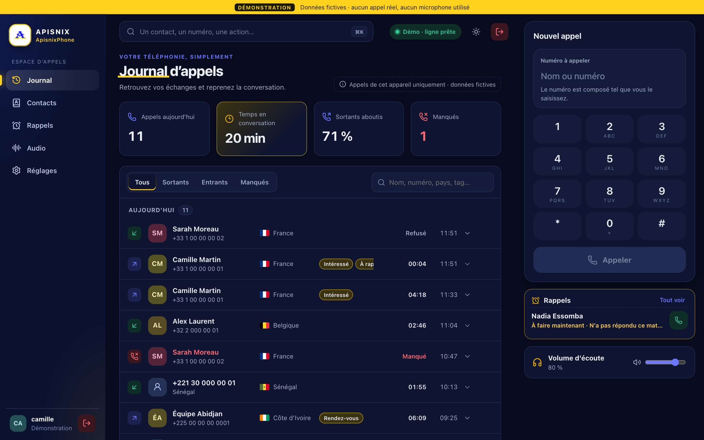

## 12. Sur téléphone ou petite fenêtre

| Journal | Téléphone |
| --- | --- |
| 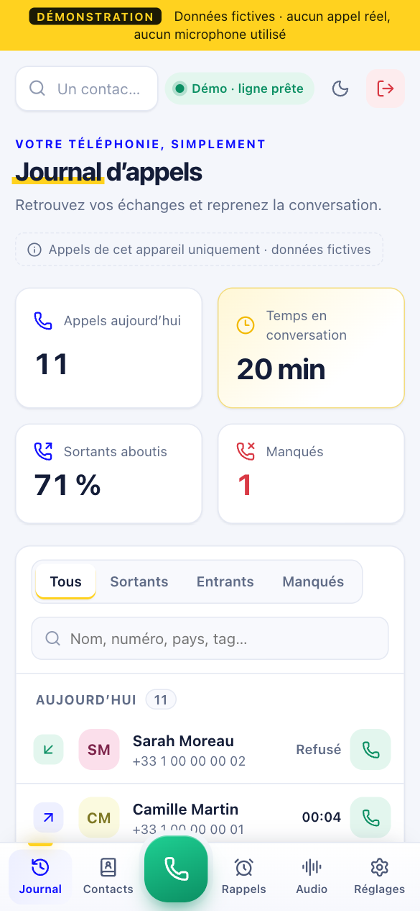 | 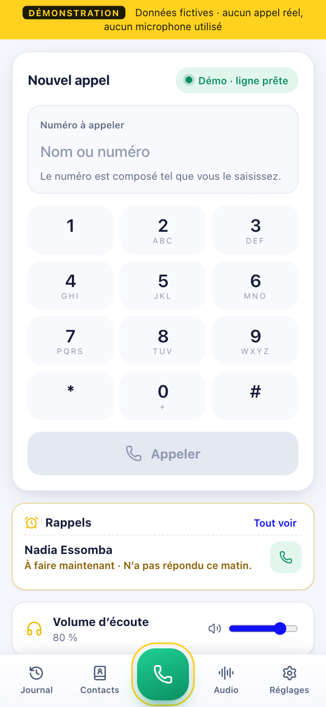 |

Le menu passe en bas de l'écran, avec le bouton vert **Téléphone** au centre.
Pendant un appel, un bandeau reste visible sur toutes les pages, avec son bouton
Raccrocher. Les Favoris s'ouvrent depuis la page Contacts.

## En cas de problème

| Ce que vous voyez | Ce que cela signifie | Que faire |
| --- | --- | --- |
| Bandeau rouge « Cette ligne est ouverte sur un autre appareil » | Votre compte vient d'être connecté ailleurs. **Ce poste se met en pause** (en deux à trois minutes) : il ne reçoit plus d'appels et ne peut plus en passer. Un appel en cours n'est pas interrompu par cette pause. | **Un compte = un seul appareil à la fois.** Cliquez **Reprendre la ligne ici** pour récupérer la ligne : c'est alors l'autre appareil qui passera en pause. Si ce n'est pas vous, prévenez votre administrateur. |
| « Appel interrompu : la connexion au serveur a été perdue » | La liaison a coupé pendant l'appel (réseau, ou compte ouvert sur un autre appareil). | Vérifiez votre réseau et rappelez ; l'appel n'est jamais rappelé automatiquement. |
| Le bouton Attente affiche « Patientez… » puis un message | Le serveur n'a pas confirmé, signe d'une connexion instable. | Réessayez ; si cela se répète, changez de réseau. |
| « Le microphone est bloqué » | Le navigateur n'a pas l'autorisation. | Cliquez sur l'icône à gauche de l'adresse de la page, autorisez le microphone, rechargez. |
| « Aucun microphone trouvé » | Casque débranché ou non reconnu. | Rebranchez-le, puis vérifiez Réglages → Audio. |
| Bouton « Activer le son » pendant un appel | Le navigateur a bloqué le son. | Cliquez sur le bouton. |
| On vous entend mal, voix hachée | Le plus souvent le réseau (Wi-Fi faible, connexion partagée). | Rapprochez-vous de la borne ou passez en filaire ; vérifiez la sensibilité du micro. |
| Bandeau « Connexion perdue : reconnexion en cours… » | Le réseau a coupé. Un appel interrompu n'est **jamais** rappelé automatiquement. | Patientez quelques secondes ; sinon reconnectez-vous et rappelez. |
| Deux notes descendantes | La ligne vient de se couper. | Même conduite que ci-dessus. |

## Bon à savoir

- Fermer l'onglet ou recharger la page pendant un appel **coupe l'appel**. Hors
  appel, une actualisation vous reconnecte si votre navigateur a retenu l'accès.
- Le drapeau indique le pays du **numéro**, pas l'endroit où se trouve la personne.
- Un numéro commençant par `0` est lu comme un numéro français ; `1` suivi d'un
  indicatif, comme un numéro d'Amérique du Nord (Canada ou États-Unis).
- Pour toute question sur votre compte ou vos droits d'appel, contactez votre
  administrateur APISNIX.
