# ApisnixPhone — guide d'utilisation

ApisnixPhone est votre téléphone professionnel dans le navigateur : rien à
installer, vous ouvrez la page, vous vous connectez, vous appelez.

Les captures de ce guide viennent de la démonstration : noms et numéros sont
fictifs. Version décrite : ApisnixPhone Web 0.1.0.

<!-- Mise en page du PDF (webphone/scripts/build-guide-pdf.mjs) : une image
titrée "gauche" ou "droite" se place sur ce côté, avec à côté d'elle le texte
qui la suit jusqu'au prochain titre ou à la prochaine image. Plusieurs images
sur une même ligne s'affichent côte à côte, légendées par leur texte
alternatif. Une hauteur dans le titre ("gauche 90mm", "60mm") remplace la
taille par défaut ; l'ajuster pour éviter les blancs en bas de page.
Versions anglaise et espagnole : GUIDE_UTILISATEUR.en.md et .es.md, captures
dans guide/en et guide/es ; les garder alignées sur ce texte. -->

## Avant de commencer

- Un ordinateur avec **Chrome ou Edge** à jour, et une connexion stable. Safari
  fonctionne pour appeler, mais il est déconseillé : les sons d'annonce n'y sont
  pas fiables.
- Un **casque avec micro** : c'est lui qui fait la qualité de vos appels.
- Votre **identifiant** et votre **mot de passe**, ou un **lien de connexion**,
  remis par votre administrateur.
- Gardez l'onglet ouvert et l'ordinateur éveillé : si la page est fermée ou le
  PC en veille, vous ne recevez plus d'appels.

## 1. Se connecter

En haut du formulaire, choisissez votre **langue** : Français, English ou
Español. Le navigateur la retient ; elle se change aussi dans Réglages →
Apparence. Saisissez ensuite votre identifiant et votre mot de passe, puis
**Se connecter**.
ApisnixPhone n'enregistre jamais votre mot de passe. Votre navigateur peut vous
proposer de le retenir : si vous acceptez, une actualisation de la page vous
reconnecte toute seule (Chrome, Edge) ou préremplit le formulaire (Safari).
**Refusez sur un ordinateur partagé.**
Vous avez reçu un **lien de connexion** ? Cliquez dessus : la ligne se connecte
toute seule, sans rien saisir. Il contient votre mot de passe : ne le partagez pas.

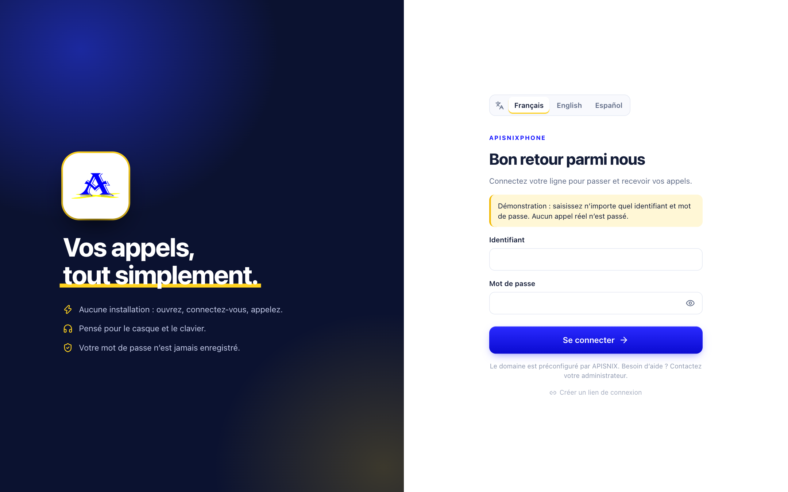

Un carillon retentit et la pastille verte **Ligne prête** apparaît : vous pouvez
appeler. Au premier appel, le navigateur demande l'accès au **microphone** :
choisissez **Autoriser**. Refusé par erreur ? Réglages → Audio → **Autoriser le
micro** le redemande, ou indique comment le débloquer si le navigateur a retenu
le refus.

| Message | Que faire |
| --- | --- |
| Identifiant ou mot de passe refusé | Vérifiez la saisie (majuscules, zéros). L'application ne réessaie pas toute seule. |
| Connexion au serveur impossible | Vérifiez votre réseau, puis réessayez. |
| Cette ligne est déjà ouverte dans un autre onglet | Fermez l'autre onglet ApisnixPhone. Si vous venez de vous déconnecter dans cet onglet, actualisez la page. |

## 2. L'écran principal

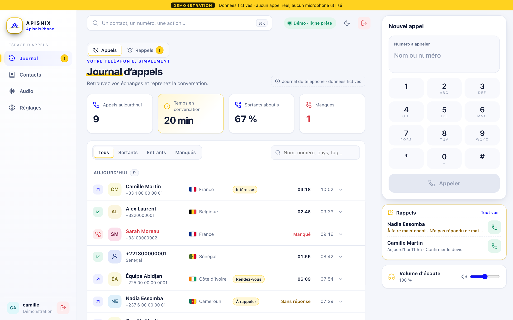

- **À gauche**, le menu : Journal, Contacts, Audio, Réglages. Les Rappels se
  trouvent dans le Journal, sous l’onglet **Rappels**. Votre
  compte et le bouton rouge **Se déconnecter** sont en bas ; le même bouton se
  trouve en haut à droite.
- **Au centre**, la page choisie.
- **À droite**, le téléphone. Il reste là quelle que soit la page : vous pouvez
  consulter vos rappels ou vos enregistrements sans quitter votre appel.
- **En haut**, la barre de recherche et l'état de la ligne.

## 3. Passer un appel

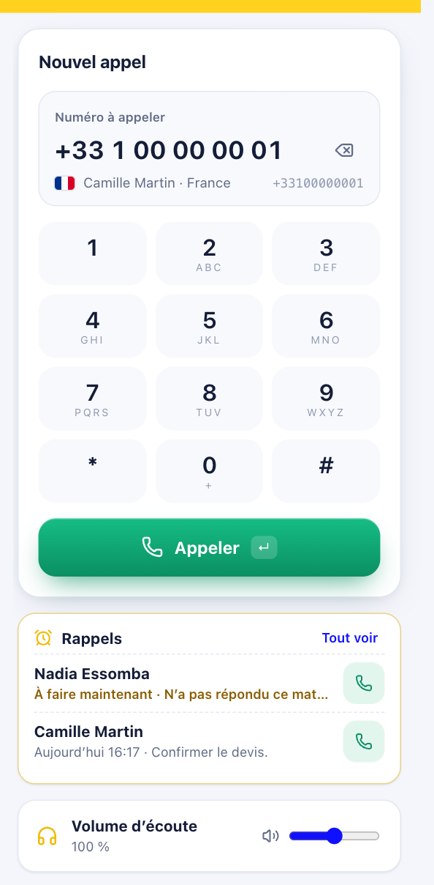

Tapez le numéro au clavier de l'ordinateur ou sur le pavé, puis **Appeler** ou
la touche **Entrée**. Vous pouvez aussi taper un **nom** : les contacts
correspondants sont proposés.

**Le numéro est composé exactement comme vous le saisissez** : aucun indicatif
n'est ajouté. Le drapeau et le pays sont une aide à la lecture ; la ligne grise
à droite montre les chiffres qui partiront réellement. Pour un `+`, maintenez la
touche **0** du pavé.

Chaque touche du pavé émet une courte tonalité, comme sur un téléphone
classique. Pour la couper : Réglages → Audio, **Sons du clavier**.

Une tonalité « toup toup » accompagne la sonnerie, puis un bref « gling »
confirme le décroché. Le chronomètre démarre alors, jamais pendant l'attente ;
avant, le bouton rouge indique **Annuler**.

## 4. Pendant l'appel

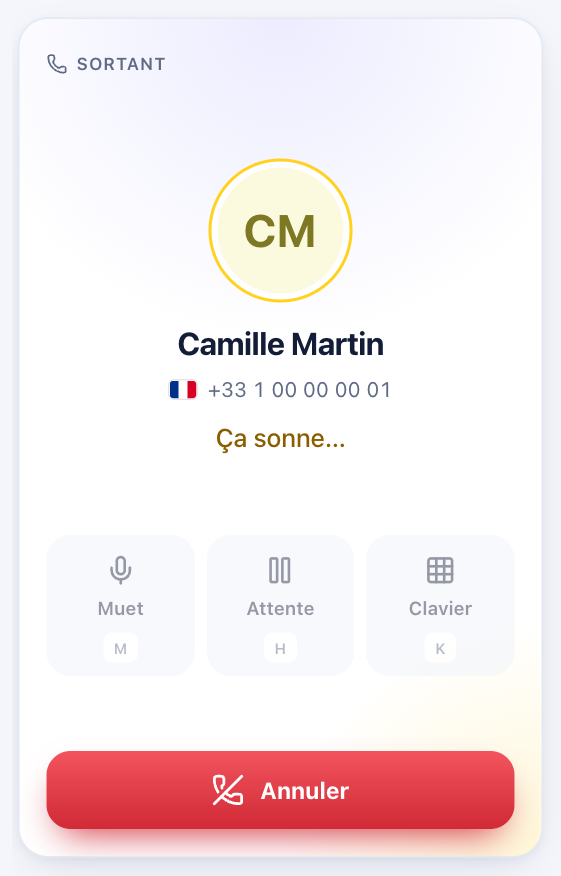 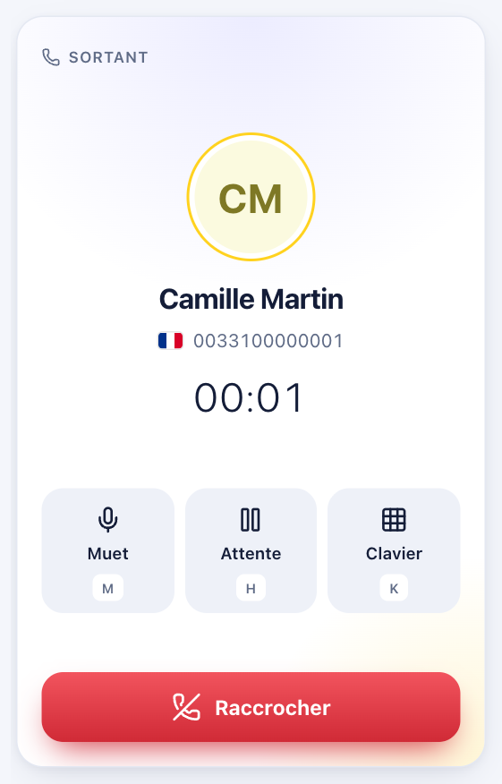 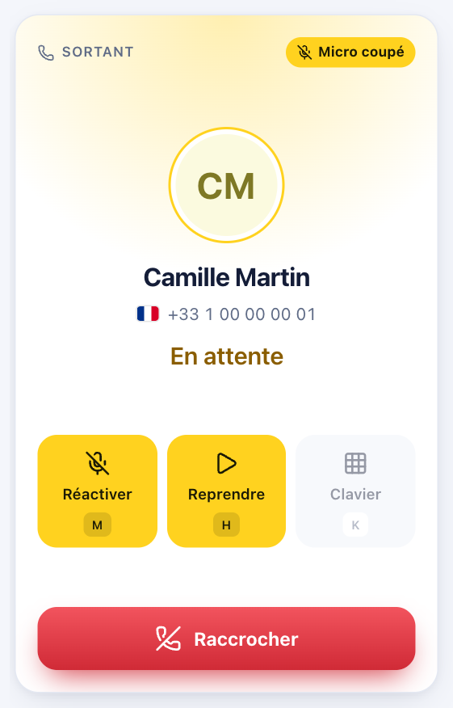

- **Muet** (touche `M`) coupe votre micro : le correspondant ne vous entend
  plus. Une étiquette jaune « Micro coupé » le rappelle.
- **Attente** (`H`) met le correspondant en attente ; **Reprendre** le
  récupère.
- **Clavier** (`K`, ou les chiffres) envoie des touches à un serveur vocal
  (« tapez 1… »).
- **Raccrocher** termine l'appel.

Les raccourcis ne fonctionnent pas pendant que vous écrivez dans un champ, et la
touche Échap ne raccroche jamais.

## 5. À la fin de l'appel

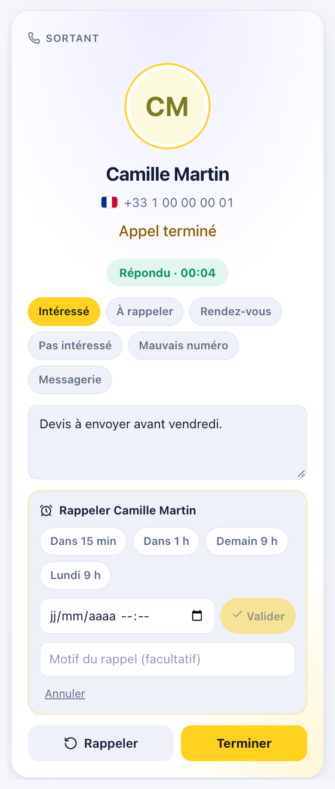

L'application indique l'issue et la durée. Vous pouvez, en quelques secondes :

- **qualifier** l'appel avec un ou plusieurs tags (Intéressé, À rappeler,
  Rendez-vous…) ;
- écrire une **note** ;
- **planifier un rappel** : « Dans 15 min », « Dans 1 h », « Demain 9 h »,
  « Lundi 9 h » ou une date précise, avec un motif facultatif ;
- **Rappeler** tout de suite, **Ajouter** le numéro à vos contacts, ou
  **Terminer**.

Si un appel échoue, à cause du micro ou d'un refus du serveur, un encadré rouge
en donne la cause. Si cela se répète, transmettez le code affiché à votre
administrateur : il reste visible dans le détail de l'appel du **Journal**.

## 6. Recevoir un appel

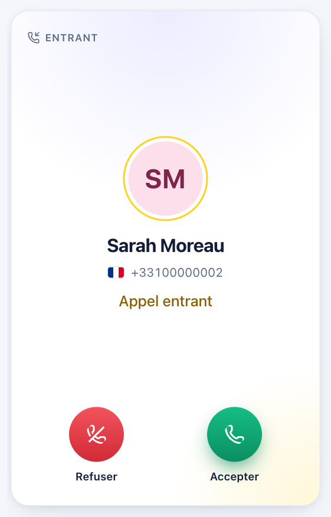

Le téléphone sonne avec la sonnerie choisie dans les Réglages, passe au premier
plan et le titre de l'onglet affiche « Appel entrant… ».

Choisissez **Accepter** ou **Refuser** : l'application ne répond jamais à votre
place.

Un appel laissé sans réponse devient **Manqué** et une pastille rouge apparaît
sur le Journal ; elle s'efface quand vous l'ouvrez.

## 7. Le journal d'appels

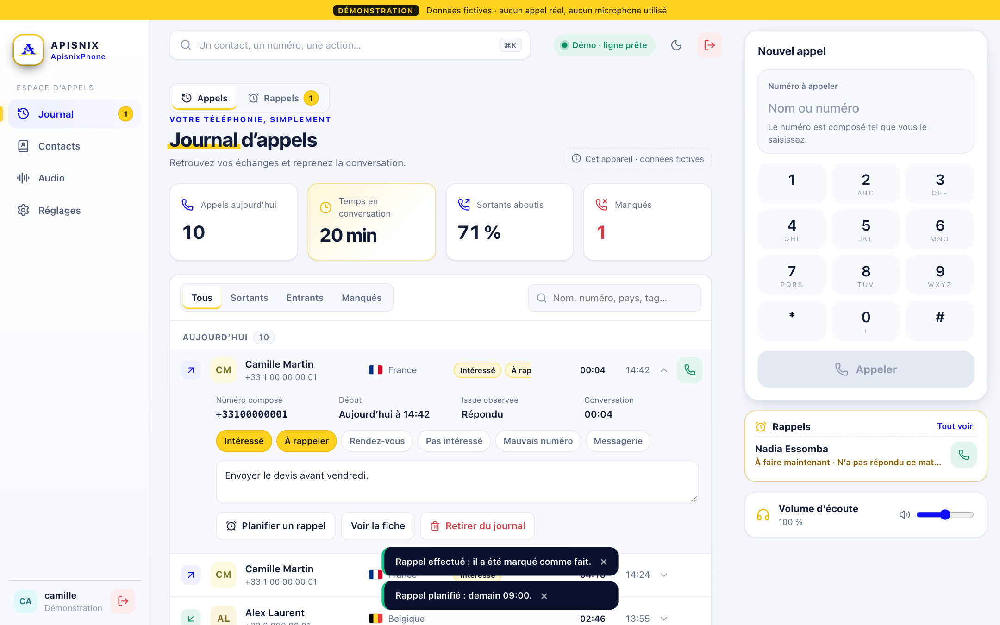

Les appels sont regroupés par jour. Filtrez par **Tous / Sortants / Entrants /
Manqués** ou cherchez un nom, un numéro ou un pays. Le bouton de rappel relance
l'appel ; un clic sur la ligne ouvre son détail.

- **Tous les appels du poste** : les 30 derniers jours, y compris les appels
  passés depuis un autre appareil. Actualisé chaque minute.
- **Cet appareil** : les appels vus par ce navigateur, avec vos tags et notes.

## 8. Les rappels

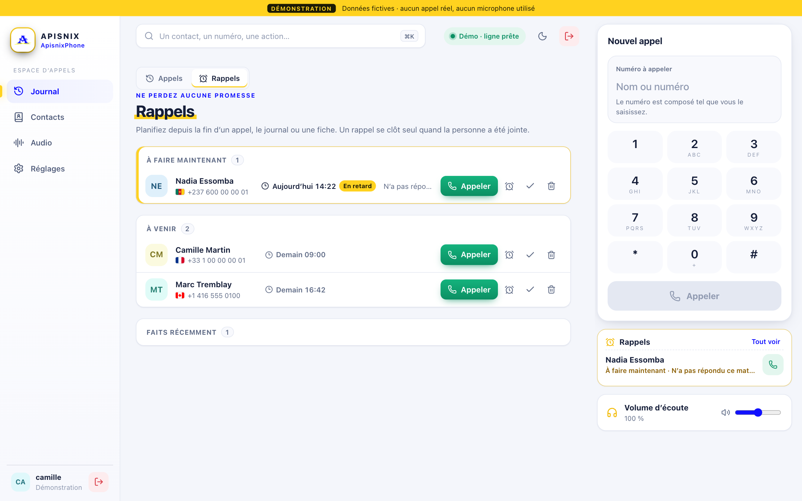

Ouvrez **Journal**, puis **Rappels**. Vos rappels sont classés **À faire
maintenant**, **Plus tard aujourd'hui** et **À venir**. À l'heure prévue,
l'application vous prévient et une pastille jaune apparaît.

Pour chaque rappel : **Appeler**, reporter d'une heure, marquer comme fait ou
supprimer. **Un rappel se clôt tout seul dès que vous avez joint la personne.**

## 9. Vos enregistrements

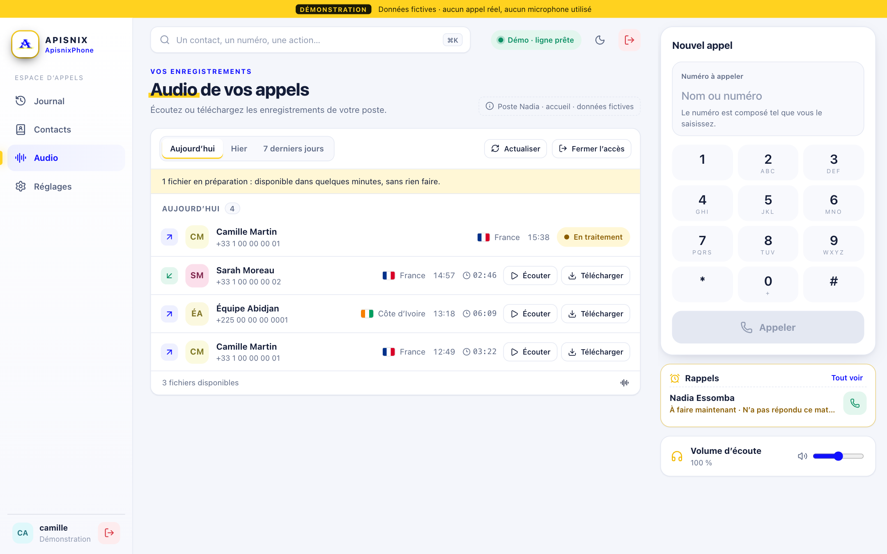

La page **Audio** rassemble les enregistrements des appels de votre poste. Ils
apparaissent **quelques minutes après la fin de l'appel** (« En traitement » en
attendant).

Choisissez la période, puis **Écouter** dans la page ou **Télécharger** le
fichier. Vous ne voyez que les enregistrements de votre poste.

Rien à saisir : l'accès s'ouvre avec votre ligne. En cas d'échec,
**Réessayer** ; sinon, contactez APISNIX.

## 10. Réglages

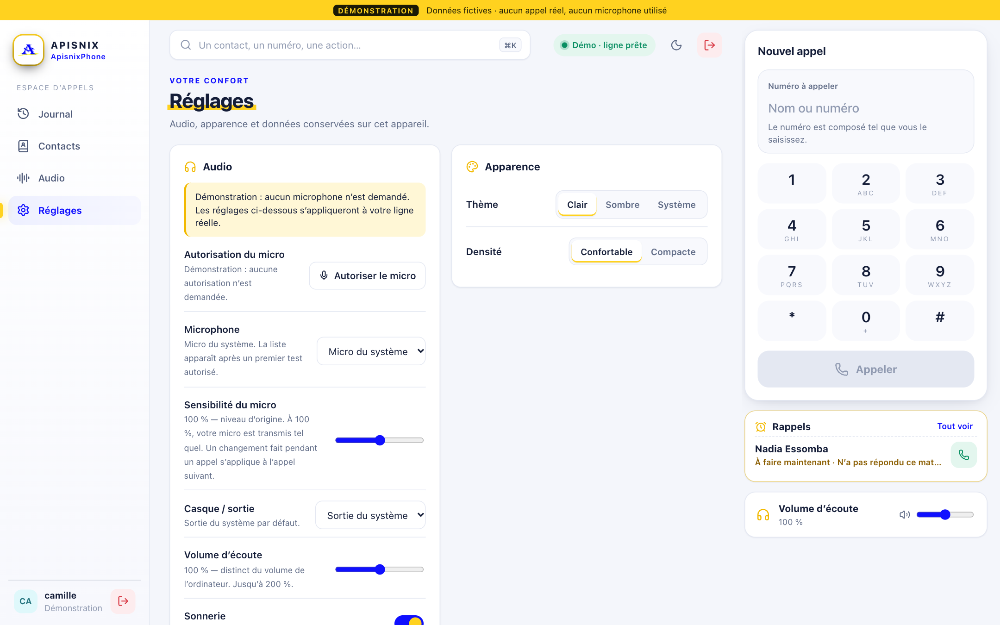

- **Audio** : autorisation et choix du micro et du casque, **sensibilité du
  micro**, **Tester le micro**, annulation d'écho, réduction de bruit, sons de
  la ligne et du clavier.
- **Volume d'écoute** : 100 % par défaut, jusqu'à **200 %** si votre
  correspondant reste trop faible. Au-delà de 100 %, préférez un casque pour
  éviter l'écho.
- **Apparence** : langue (Français, English, Español), thème Clair, Sombre ou
  Système, densité d'affichage.
- **Appels** : notifications du système, utiles si vous travaillez souvent dans
  une autre fenêtre.

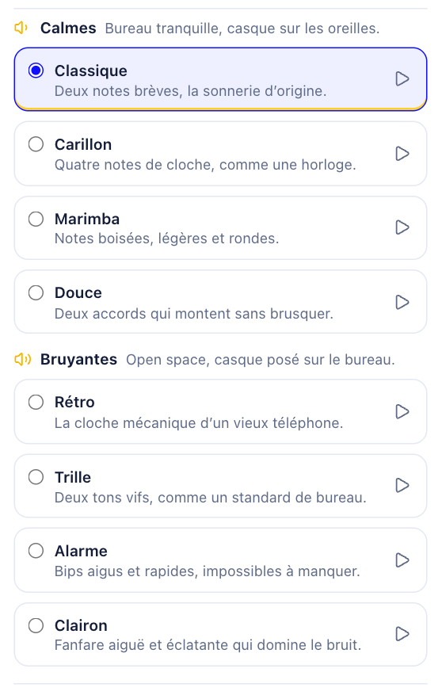

- **Sonnerie** : huit sons. Les **calmes** (Classique, Carillon, Marimba,
  Douce) pour un bureau tranquille ; les **bruyantes** (Rétro, Trille, Alarme,
  Clairon) pour un open space. Touchez un son pour le choisir ; ▶ l'écoute sans
  le choisir.
- **Données de cet appareil** : par défaut, contacts, notes et journal local
  disparaissent à la déconnexion. **Conserver sur cet appareil** les garde :
  **jamais sur un ordinateur partagé.**
- **Compte** : votre identifiant, la version, **Se déconnecter**.

## 11. Sur téléphone ou petite fenêtre

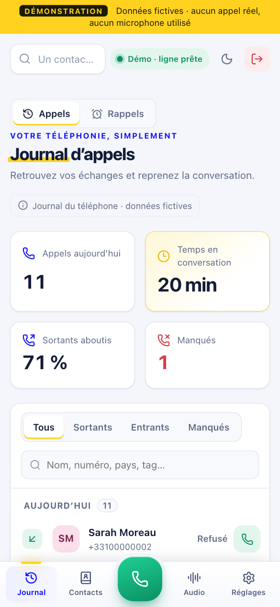 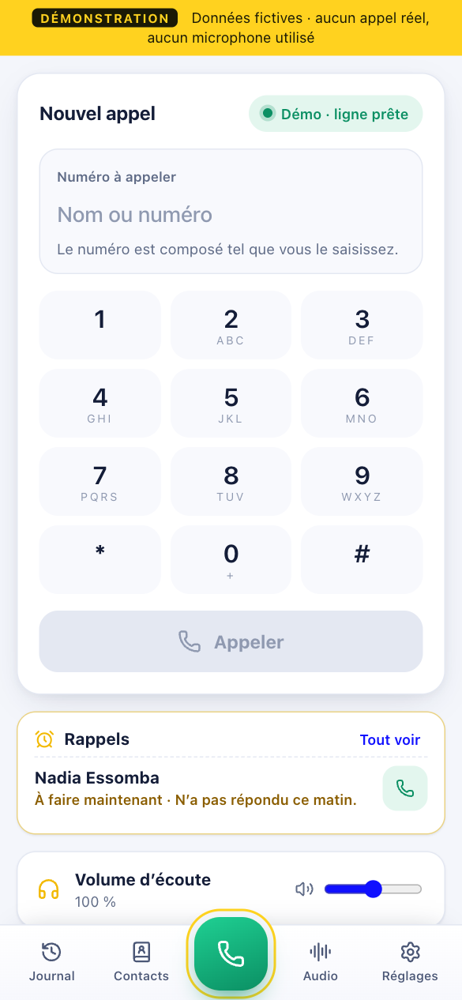

Le menu passe en bas de l'écran, avec le bouton vert **Téléphone** et l'accès
**Audio** toujours visibles.

Pendant un appel, un bandeau reste visible sur toutes les pages, avec son
bouton **Raccrocher**.

## En cas de problème

| Ce que vous voyez | Que faire |
| --- | --- |
| « Cette ligne est ouverte sur un autre appareil » | **Un compte = un seul appareil à la fois** : ce poste se met en pause. **Reprendre la ligne ici** la récupère. Si ce n'est pas vous, prévenez votre administrateur. |
| « Connexion perdue », « Appel interrompu » ou deux notes descendantes | Le réseau a coupé. Patientez quelques secondes, vérifiez votre réseau et rappelez : un appel n'est **jamais** rappelé automatiquement. |
| Attente : « Patientez… » puis un message | Connexion instable : réessayez, ou changez de réseau. |
| « Le microphone est bloqué » | Réglages → Audio → **Autorisation du micro**, ou icône à gauche de l'adresse → Microphone → Autoriser. |
| « Aucun microphone trouvé » | Rebranchez le casque, puis vérifiez Réglages → Audio. |
| Bouton « Activer le son » | Cliquez dessus : le navigateur avait bloqué le son. |
| On vous entend mal, voix hachée | Souvent le Wi-Fi : rapprochez-vous de la borne ou passez en filaire. |

## Bon à savoir

- Fermer l'onglet ou recharger la page pendant un appel **coupe l'appel**.
- Le drapeau indique le pays du **numéro**, pas l'endroit où se trouve la
  personne. Un numéro commençant par `0` est lu comme un numéro français.
- Pour toute question sur votre compte ou vos droits d'appel, contactez votre
  administrateur APISNIX.
