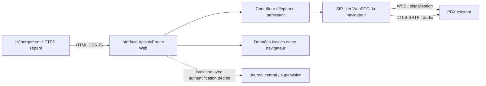

# ApisnixPhone Web — plan de réalisation et de reprise

**Référence produit et technique préparée le 18 septembre 2026.**
Début de réalisation envisagé le 19 septembre, sur demande de Franck.
Statut au 21 septembre : **lots 1 à 4 réalisés dans `webphone/`** (interface
complète, démonstration par défaut, adaptateur SIP.js testé en simulation) ;
lots 5 et 6 à faire — **aucun appel réel n'a encore été passé**.

## 1. Reprendre dans une nouvelle conversation

Lire dans cet ordre :

1. `AGENTS.md`, puis ce document, qui porte le périmètre web courant.
2. [État du projet](PROJECT_STATE.md), pour distinguer les versions natives déjà
   produites de cette nouvelle application.
3. [Maquette navigable](design/webphone-maquette.html) : direction visuelle avec
   données fictives, sans microphone, connexion SIP ni appel réel.
4. Pour tout raccordement serveur : dépôt **privé** `FranckThiago/Gestion_CRM-APISNIX`,
   son `AGENTS.md`, `docs/TABLEAU_DE_BORD.md`, puis
   `docs/AUDIT_WEBRTC_20260918.md`. Clone Mac :
   `/Users/franckabouna/Projets_Claude/Gestion_CRM-APISNIX`.

Le dépôt courant est public : aucun compte client, mot de passe, clé, sauvegarde
ou journal de production ici. Les références détaillées du serveur restent dans
le dépôt privé. L'audit est daté ; vérifier l'état réel avant une future mutation.

**Action de reprise par défaut :** inspecter Git, développer l'application dans
`webphone/`, commencer en mode démonstration indépendant du PBX, vérifier le
rendu et les tests, puis préparer le pilote réel. Ne pas relancer une étude
EXE/MSI, de nouveaux certificats, un remplacement de PBX ou un CRM complet.

Le code web existe dans `webphone/` et les commandes de la section 13
fonctionnent. La prochaine étape est le lot 5 : créer `webphone/.env.local`
(ignoré par Git) avec `VITE_APP_MODE=live`, `VITE_SIP_DOMAIN` et
`VITE_SIP_WSS_URL` pris dans la fiche privée, puis dérouler la section 14 avec
le compte et la destination autorisés. Points à regarder en premier : le `+` et
le `#` dans l'URI (`#` est envoyé `%23`, le reste tel quel), les codes de refus
réellement renvoyés, et la chaîne micro Web Audio sur un vrai casque.

## 2. Demande confirmée et choix retenus

| Sujet | Décision / statut |
| --- | --- |
| Produit | Application web d'appels sous la marque APISNIX ; nom affiché ApisnixPhone |
| Public | Utilisateurs de postes SIP manuels sur PC ; appels sortants prioritaires |
| Motif | Éviter l'installation Windows et les demandes administrateur ; améliorer fortement l'interface |
| Téléphonie | Réutiliser le WebRTC fonctionnel du serveur ; conserver VICIdial en production |
| Design demandé | Belle application complète, colorée, inspirée de Ringover et Kavkom, avec drapeaux des pays appelés |
| Format | Espace de travail large avec journal/contacts et panneau d'appel persistant |
| Navigateur | Chrome et Edge sur PC prioritaires ; autres navigateurs selon essais et capacités détectées |
| Veille/mobile | Navigateur ouvert et PC éveillé acceptés ; réception mobile en veille hors périmètre |
| Certificats | Aucun achat, remplacement ou renouvellement imposé par ce projet ; HTTPS/WSS actuel valide à l'audit |
| Numérotation | Conserver le numéro voulu ; aucune insertion silencieuse de +237 ou d'un autre préfixe |
| Natif | Conserver les pilotes Windows/Android existants ; aucune suppression ou migration automatique |
| Aujourd'hui | Recherche, plan, maquette et documentation ; aucun déploiement ni intervention serveur |

Les détails d'interface, de stockage et d'outillage ci-dessous sont des **choix
d'implémentation proposés pour démarrer**, pas des fonctionnalités déjà livrées
ni des préférences personnellement validées une par une par Franck.

## 3. Résultat de la recherche et références

### Inspiration visuelle

Captures examinées dans Google Images puis sur les sites officiels le 18 septembre.

- [Ringover : passer et recevoir des appels](https://support.ringover.com/hc/fr/articles/13831637642257-Comment-passer-et-recevoir-des-appels) :
  espace clair, navigation et recherche, clavier accessible pendant le travail,
  drapeau près du numéro, contexte du contact et commandes visibles.
- [Kavkom : webphone](https://kavkom.com/informations-utiles/webphone-app/) :
  carte d'appel avec interlocuteur, commandes micro/clavier/attente/audio,
  intégration dans un espace de travail plus large que le clavier.

En tirer une hiérarchie lisible et un parcours fluide, avec logo, palette,
composants et contenus propres à APISNIX. Les captures tierces ne sont pas des
assets à intégrer dans le produit. Les fonctions affichées chez ces éditeurs
ne prouvent pas leur disponibilité sur notre PBX.

### Base téléphonique

L'interface existante utilise SIP.js 0.20.1. Pour la nouvelle application isolée,
**retenir SIP.js 0.21.2**, dernière release publiée affichée au contrôle, sous MIT.
La date de publication ancienne ne constitue pas une garantie de maintenance.
La version doit être figée et l'interopérabilité vérifiée sur le pilote.
Ne pas remplacer la bibliothèque servie au webphone VICIdial.

La [release officielle](https://github.com/onsip/SIP.js/releases/tag/0.21.2),
les [changements 0.21.1](https://github.com/onsip/SIP.js/releases/tag/0.21.1) et le
[guide de migration](https://github.com/onsip/SIP.js/blob/main/docs/migration-0.20-0.21.md)
expliquent les évolutions d'API, notamment le DTMF RTP et la suppression
d'anciennes options. Les déclarations TypeScript et le code du paquet npm
0.21.2 ont été inspectés localement : `SessionManager` expose les appels,
l'attente/reprise, le micro, le DTMF et le transfert. C'est une preuve d'API,
pas un test d'appel. Ne pas recopier les options de l'ancien script sans examen.

### Contraintes du navigateur vérifiées

- [Microphone](https://developer.mozilla.org/en-US/docs/Web/API/MediaDevices/getUserMedia) :
  HTTPS, permission utilisateur, erreurs distinctes pour refus, périphérique
  absent ou indisponible. La demande peut rester sans réponse ; prévoir cet état.
- [Sortie audio](https://developer.mozilla.org/en-US/docs/Web/API/HTMLMediaElement/setSinkId) :
  sélectionner un casque dépend de l'API, des permissions et du navigateur.
  Repli explicite sur la sortie système si le choix n'est pas disponible.
- [Lecture audio automatique](https://developer.mozilla.org/en-US/docs/Web/Media/Guides/Autoplay) :
  le son peut être bloqué. Traiter le rejet de `play()` et proposer « Activer le
  son », sans annoncer un casque fonctionnel avant lecture réussie.
- [Verrou entre onglets](https://developer.mozilla.org/en-US/docs/Web/API/Web_Locks_API) :
  coordonner une seule session sur une même origine. Ne protège pas contre un
  softphone, une autre origine ou un autre ordinateur connecté au même compte.
- [Pays et numéros](https://github.com/catamphetamine/libphonenumber-js) :
  métadonnées utilisables pour l'affichage ; éviter une validation trop stricte
  qui bloquerait des extensions ou préfixes autorisés par le PBX.

## 4. Architecture cible



L'hébergement de l'interface sert les fichiers ; il ne transporte pas les appels.
Le média rejoint le PBX directement ou un relais TURN si un besoin est démontré.
Pas de proxy SIP maison, moteur audio réécrit, accès SQL/AMI depuis le navigateur
ou service Node permanent nécessaire pour la première version.

**Choix du socle :** React + TypeScript + Vite, CSS avec variables et composants
propres, SIP.js, libphonenumber-js, icônes Lucide et drapeaux SVG locaux. Une SPA
statique est suffisante ; pas de Next.js/SSR, Redux, CRM, Docker ou base serveur
ajoutés sans besoin concret. Le contrôleur SIP doit survivre à la navigation
entre Journal, Contacts et Réglages.

### Versions relevées dans le registre npm le 18 septembre

| Paquet / outil | Version de référence | Rôle |
| --- | --- | --- |
| Node local | 22.23.2 | Compatible avec les engines annoncés de Vite/Vitest |
| npm local | 10.9.8 | Gestion des dépendances et lockfile |
| react / react-dom | 19.3.0 | Interface |
| typescript | 6.0.3 | Typage ; version retenue pour la compatibilité du lint |
| vite | 8.3.0 | Développement et build statique |
| @vitejs/plugin-react | 6.1.1 | Intégration React ; plugins de compilation avancée optionnels, inutiles au départ |
| sip.js | 0.21.2 | SIP/WebRTC ; MIT |
| libphonenumber-js | 1.13.13 | Métadonnées des numéros ; MIT |
| lucide-react | 1.47.0 | Icônes cohérentes ; ISC |
| country-flag-icons | 1.6.20 | Drapeaux SVG ; MIT |
| vitest | 5.0.1 | Tests métier et contrôleur simulé |
| @playwright/test | 1.63.0 | Parcours automatisés isolés, sans connexion PBX |
| eslint / typescript-eslint | 10.10.0 / 8.70.0 | Lint ; TypeScript supporté de 4.8.4 à strictement moins de 6.1 |
| eslint-plugin-react-hooks / eslint-plugin-react-refresh | 7.1.1 / 0.5.7 | Règles React, compatibilité ESLint 10 déclarée |

Versions contrôlées comme publiées ; la combinaison complète n'a pas encore été
installée ou compilée. À l'initialisation, vérifier la résolution et les types,
figer les versions exactes et le lockfile, puis utiliser `npm ci`. Pas de mise
à jour arbitraire de SIP.js pendant le pilote. Types React vérifiés en 19.3.0.
TypeScript 7.0.2 est également publié, mais n'est pas retenu : la version
vérifiée de typescript-eslint annonce `<6.1.0`. Éviter cette incompatibilité dès
l'initialisation ; ne pas masquer un conflit avec `--force` ou `--legacy-peer-deps`.

## 5. Design et navigation

Voir la [maquette locale](design/webphone-maquette.html). Elle couvre le Journal,
les Contacts, les Favoris, les Réglages et un appel simulé. Ses chiffres et noms
sont fictifs. Elle n'est ni une application connectée ni un engagement à conserver
chaque détail pixel pour pixel après les essais.

### Disposition desktop

```text
┌──────────────────┬─────────────────────────────────┬──────────────────────┐
│ APISNIX          │ Journal d'appels      Recherche  │ Compte / état        │
│ ApisnixPhone     │ Vue et filtres                   │                      │
│                  │                                 │ Composer             │
│ Journal          │ Appels du navigateur             │ Pays + numéro        │
│ Contacts         │ Résultat · pays · heure · durée  │ Clavier / appeler    │
│ Favoris          │                                 │                      │
│                  │ Détail / notes du contact        │ Appel en cours       │
│ Réglages         │                                 │ Identité · durée     │
│ Aide / profil    │                                 │ Micro / attente / fin│
└──────────────────┴─────────────────────────────────┴──────────────────────┘
```

- À 1440 px : navigation 200 px, centre flexible, panneau d'appel 330–360 px.
- À 1280/1366 px : navigation compacte 176 px, panneau 310–330 px ; aucun
  chevauchement du bouton Raccrocher, des numéros ou des titres.
- Entre 900 et 1100 px : rail d'icônes étiquetées au focus, centre simplifié.
- En dessous : panneau d'appel accessible via une vue dédiée ; bandeau d'appel
  persistant. Ne pas cacher une action essentielle dans un défilement horizontal.
- L'appel reste monté quand une vue change. Les fenêtres secondaires ne prennent
  jamais le focus au détriment du raccrochage.

### Identité et tokens proposés

Le [logo original](../branding/apisnix-mark.png) est réutilisé intact. Le bleu
historique APISNIX reste présent ; le jaune devient un accent mesuré.

| Token | Valeur proposée | Usage |
| --- | --- | --- |
| brand | `#1010FF` | Action principale et sélection |
| brand-soft | `#EEEEFF` | Fond discret de sélection |
| navy | `#111A35` | Navigation, panneau d'appel contrasté |
| yellow | `#F4C543` | Identité et accent ; texte sombre par-dessus |
| canvas | `#F5F7FB` | Fond principal |
| surface | `#FFFFFF` | Surfaces de travail |
| text | `#16213B` | Texte principal |
| muted | `#65718A` | Texte secondaire |
| border | `#E3E8F1` | Séparations légères |
| success | `#087B61` | Connecté / appel établi |
| danger | `#C6384B` | Raccrochage, manqué et erreur |
| warning | `#956300` | Attente et action requise |

Police système lisible pour éviter une requête externe ; Inter auto-hébergée
possible plus tard. Corps 14–16 px, titres 24–30 px, petit texte au moins 12 px.
Espacement sur base 4/8 px ; angles 10–18 px, pas de capsules partout.
Icônes 18–22 px, cibles tactiles 44 px, transitions 120–180 ms avec prise en
compte de la réduction des animations. Contraste à mesurer dans les écrans réels
(objectif texte courant 4,5:1). Couleur toujours doublée d'un libellé ou symbole.

### Écrans et états à réaliser

| Écran | Contenu et comportement |
| --- | --- |
| Connexion | Logo, identifiant et mot de passe ; domaine préconfiguré ; erreur lisible ; pas de jargon SIP en premier plan |
| Préparation audio | Choisir micro/casque, vérifier le niveau micro, écouter un son local sur clic ; état de permission explicite |
| Journal | Liste recherchable, Tous/Sortants/Entrants/Manqués, date/durée/pays/résultat ; rappel depuis chaque ligne |
| Détail d'appel | Numéro réellement composé, dates, durée de conversation, issue observée, contact et note locale facultative |
| Contacts | Création/modification/suppression locale, recherche, plusieurs numéros libellés, favoris ; pas d'import système automatique |
| Favoris | Accès rapide aux contacts ; action Appeler distincte pour éviter les appels accidentels |
| Disponible | Panneau de composition, état connecté, saisie et collage ; bouton désactivé tant qu'un prérequis manque |
| Appel sortant | Identité, pays, étapes connexion/sonnerie, Annuler ; le temps de conversation commence au décroché |
| Appel entrant | Identité/numéro, Accepter/Refuser ; aucune réponse automatique héritée de VICIdial |
| Appel actif | Durée, micro, attente/reprise, clavier DTMF, volume, raccrochage ; écran utilisable au clavier |
| Appel en attente | État textuel, reprendre ; modifier l'UI après confirmation de la mise en attente |
| Fin d'appel | Résultat, durée, rappel volontaire, ajout au contact ; pas de rappel automatique |
| Réglages | Audio, affichage, comportement, données locales, informations du compte |
| Hors connexion | Message et bouton Réessayer ; aucune pastille Connecté si seul le WebSocket est ouvert |

## 6. Fonctionnalités et critères de livraison

**V1** signifie inclus dans l'application à construire. **Pilote** signifie
que l'interface peut être codée, mais que son usage réel doit être testé. **Suite**
reste une évolution séparée ; ne pas faire apparaître des boutons factices.

| Fonction | Niveau | Critère observable |
| --- | --- | --- |
| Connexion/déconnexion SIP | V1 + pilote | Enregistrement confirmé ; erreur terminale sans boucle de mot de passe |
| Appel sortant / annuler / raccrocher | V1 + pilote | Bon numéro, un seul appel par clic, nettoyage de session |
| Réponse/refus entrant | V1 + pilote | Réponse volontaire ; identité non interprétée comme du HTML |
| Micro muet / actif | V1 + pilote | Piste locale désactivée/réactivée et retour visuel exact |
| Attente / reprise | V1 + pilote | Re-INVITE accepté, audio réellement repris ; échec affiché |
| DTMF | V1 + pilote | RFC2833/telephone-event via WebRTC et serveur vocal testé |
| Choix micro et sortie | V1 + pilote | Permissions gérées, repli système, débranchement géré |
| Volume et sonnerie | V1 | Contrôle du son local ; ne pas confondre volume distant et gain microphone |
| Drapeaux et pays | V1 | Métadonnées d'affichage, ambiguïtés explicites, chiffres intacts |
| Journal du navigateur | V1 | Appels réellement observés, filtre et rappel, portée indiquée |
| Contacts/favoris/notes | V1 | Stockage local selon choix utilisateur, modification durable si activée |
| Recherche | V1 | Noms, numéros et pays affichés ; recherche insensible aux accents pour les noms |
| États réseau et messages utiles | V1 | Reconnexion bornée, aucune fausse garantie de reprise d'un appel coupé |
| Raccourcis clavier | V1 | Entrée pour appeler seulement depuis la saisie prête ; Échap ferme un panneau, ne raccroche pas par surprise |
| Un seul onglet actif | V1 | Second onglet informe et ne s'enregistre pas silencieusement |
| Notifications système | Option V1 | Sur demande explicite, facultatives ; interface utilisable si refus |
| Statistiques personnelles | V1 limité | Calculées sur le journal local, période et portée affichées |
| Transfert simple | Pilote complémentaire | SIP REFER supporté par la bibliothèque ; droits et routage vérifiés avant activation |
| Double appel / transfert accompagné | Suite | Ne pas contourner les limites de ligne actuelles ; deuxième session autorisée et testée |
| Journal central / enregistrements | Suite | Authentification et isolation par compte, accès serveur dédié ; pas de lien public vers les audios |
| Campagnes, robot d'appel, SMS, IA, CRM complet | Hors V1 | Pas de faux module pour imiter les concurrents |
| Vidéo, caméra, géolocalisation, partage écran | Hors périmètre | Aucune demande de permission correspondante |

Un appel simultané au départ : `maxSimultaneousSessions: 1`. Le transfert
accompagné ne peut pas être promis avec cette limite ou avec les limites PBX
actuelles. Afficher seulement les fonctions dont la capacité est activée et
vérifiée. L'interface doit rester complète pour les usages validés.

## 7. Réglages et valeurs initiales

| Réglage utilisateur | Valeur initiale / règle |
| --- | --- |
| Langue | Français |
| Apparence | Système par défaut (demande de Franck) ; clair et sombre au choix |
| Densité | Confortable ; compacte possible sur petits écrans |
| Micro | Périphérique système ; choix explicite possible |
| Sortie / casque | Sortie système ; choix seulement si API et permission disponibles |
| Volume d'écoute | 80 %, réglable ; jamais assimilé au volume système |
| Sonnerie | Activée après interaction utilisateur ; choix simple de sons locaux |
| Annulation d'écho | Préférence activée si navigateur compatible |
| Réduction de bruit / gain automatique | Préférences activées ; ne pas garantir leur prise en compte par tous les matériels |
| Réponse automatique | Désactivée |
| Notifications système | Non demandées au chargement ; activation volontaire |
| Reconnexion réseau | Bornée ; pas de nouvelle tentative après rejet définitif d'identifiants |
| Pays par défaut | Aucun préfixe ajouté automatiquement |
| Historique persistant | Choix explicite « Conserver sur cet appareil », désactivé sur la première visite |
| Mot de passe mémorisé | Aucun stockage applicatif ; depuis le 21 septembre, enregistrement **proposé par le navigateur** dans son propre gestionnaire (Chrome, Edge) pour reconnecter après une actualisation, désactivé par une déconnexion volontaire |
| Journaux techniques | Désactivés par défaut ; diagnostic expurgé sur action utilisateur |
| Transfert | Masqué tant que non validé pour le pilote |

Un changement de micro pendant l'appel demande un remplacement de piste
contrôlé : conserver l'ancienne jusqu'au succès ; en cas d'échec expliquer et
revenir à la piste précédente. La préécoute/test micro ne doit jamais persister
en arrière-plan après fermeture du test. Pas de téléchargement automatique
d'un enregistrement audio de test.

### Paramètres de déploiement, hors écran utilisateur courant

Valeurs à récupérer dans la fiche privée, jamais dans un message client :

- `VITE_SIP_DOMAIN` et `VITE_SIP_WSS_URL` : informations publiques de connexion,
  aucune clé ni mot de passe dans une variable `VITE_*`.
- `VITE_APP_MODE=demo|live`, préférence demo pour tout développement/QA automatisé.
- `VITE_ENABLE_TRANSFER=false`, capacité après validation réelle.
- Configuration STUN/TURN : conserver la stratégie connue pour le pilote ;
  ne jamais incorporer un secret TURN durable dans un bundle public.
- `VITE_HISTORY_API_URL` : absent en V1 locale ; renseigner uniquement avec une
  authentification indépendante et un contrat d'accès approuvé.

Prévoir `.env.example` sans secret. Ne pas écraser un `.env` existant. Un écran
d'information peut montrer la version et l'état de connexion ; aucun formulaire
libre d'administration PBX, port réseau, secret AMI ou requête SQL.

## 8. Comportement téléphonique à implémenter

### Contrôleur persistant

Adapter `Web.SessionManager` derrière un `PhoneController` indépendant des vues.
Un `DemoPhoneController` expose les mêmes événements sans réseau. Le choix est
explicite ; une démo ne doit jamais créer de `WebSocket`, demander le micro ou
envoyer une requête vers le PBX. Elle affiche « Démonstration » en permanence.

API interne proposée : `connect`, `disconnect`, `call`, `answer`, `decline`,
`hangup`, `setMuted`, `setHeld`, `sendDtmf`, `setInputDevice`, `setOutputDevice`.
Abonnement d'état unique via React Context/useSyncExternalStore ou équivalent
simple. Protéger l'initialisation contre les doubles effets de développement.

Options SIP.js dont le nom a été vérifié dans le paquet 0.21.2 :

| Élément | Choix / raison |
| --- | --- |
| `aor` | Identité SIP du compte ; distincte de l'identité utilisateur VICIdial |
| `maxSimultaneousSessions` | `1` pour le premier pilote |
| `media.constraints` | `{ audio: true, video: false }` |
| `media.remote.audio` | Élément audio stable, hors vue qui se démonte |
| `userAgentOptions.authorizationUsername` / `authorizationPassword` | Saisie en mémoire uniquement |
| `userAgentOptions.contactParams` | `{ transport: 'wss' }`, conforme au parcours observé |
| `userAgentOptions.logConfiguration` / `logBuiltinEnabled` | `false` ; pas de trace SIP détaillée en production |
| `registrationRetry` | `false` : pas de boucle de REGISTER après refus |
| `reconnectionAttempts` / `reconnectionDelay` | Valeurs initiales 3 / 4 secondes de la bibliothèque ; une seule stratégie de retry |
| `optionsPingInterval` | Non défini au départ ; aucun ping agressif ajouté au PBX |
| `sendDTMFUsingSessionDescriptionHandler` | `true` pour le mode RTP correspondant au parcours existant |

Attente/reprise : `hold` / `unhold`, état confirmé par `onCallHold`.
Le succès de la promesse d'envoi n'est pas la confirmation distante.
Transfert : `transfer(session, target)` après validation ; suivre le résultat
réel avant de quitter l'appel ou d'afficher « Transféré ».

Codecs : commencer avec l'audio G.711 µ-law compatible avec l'existant. Ne pas
inventer une option `preferredCodec` de SIP.js : utiliser les capacités WebRTC
supportées si un ordre doit être imposé, puis vérifier l'offre/réponse. Éviter
les modifications SDP par expressions régulières. Préserver telephone-event
pour les DTMF. Ne pas activer de transcodage ou installer un codec serveur.

### États distincts

Connexion : `offline → connecting → registering → ready`, avec variantes
`auth-error`, `network-error`, `reconnecting`, `other-tab-active`.

Appel : `idle → dialing/ringing-in → ringing-out/connecting → active → held
→ ending → ended`, avec chemins d'échec/refus/annulation.

- WebSocket ouvert ≠ compte enregistré ; compte enregistré ≠ appel établi.
- Ne démarrer la durée de conversation qu'après `onCallAnswered`.
- Le média précoce/sonnerie ne doit pas être compté comme une conversation.
- Double clic Appeler verrouillé immédiatement ; DTMF sérialisé.
- Un 401/407 initial peut être un challenge normal traité par la bibliothèque ;
  ne pas l'afficher immédiatement comme mauvais mot de passe. Arrêter après
  un échec d'authentification terminal, un 403 ou un refus équivalent.
- En cas de perte réseau, ne pas rappeler ni reprendre un appel terminé
  automatiquement. Distinguer fin distante connue et interruption observée.
- Libérer pistes, sons, timers et verrou à la déconnexion. Une fermeture brutale
  de navigateur ne garantit pas l'envoi d'un BYE ; le serveur conserve ses règles.
- Web Lock par origine/domaine/compte, `ifAvailable`, sans `steal`. Pas de reprise
  automatique de l'autre onglet en cours d'appel. Pas de promesse interappareils.

## 9. Numéros, pays et drapeaux

Stocker séparément `rawInput`, `dialTarget` et les métadonnées d'affichage.

1. Conserver le contenu saisi pour l'affichage et le diagnostic local.
2. Nettoyer uniquement les séparateurs visuels explicitement permis
   (espaces, parenthèses, tirets), sans changer les chiffres, le + ou les zéros.
3. Montrer le numéro qui sera composé avant Appeler ; ne pas convertir
   silencieusement `00` en `+`, ni un numéro national en international.
4. Utiliser libphonenumber-js pour **afficher** pays/indicatif ; ne pas remplacer
   `dialTarget` par sa propriété normalisée `.number`.
5. Règles d'affichage demandées par Franck le 21 septembre, sans effet sur les
   chiffres composés : un numéro commençant par `0` (hors `00`) est lu comme
   national **France** (`NATIONAL_COUNTRY` dans `numbers.ts`) ; `1` suivi d'un
   indicatif régional (2–9) est lu comme Amérique du Nord, avec ou sans `+`.
   Le **Canada** est reconnu par la liste d'indicatifs fournie par Franck
   (`CANADIAN_AREA_CODES`, qui inclut à sa demande 600 et 888) ; les autres
   indicatifs donnent les États-Unis, sauf pays du plan +1 connu des métadonnées
   (Caraïbes). Avant trois chiffres d'indicatif : Canada. `1001` et les numéros
   courts restent « Numéro interne » ; sinon globe et « Pays non déterminé ».
6. Un choix explicite dans un sélecteur d'indicatif peut insérer ce préfixe en
   le montrant ; le simple changement de langue/région ne modifie jamais la saisie.
7. Filtrer les caractères de contrôle et les URL SIP arbitraires ; construire
   une URI par l'API, avec test du traitement de `#`, `*` et du +. Pas de collage
   de texte libre dans des en-têtes SIP ou de HTML depuis l'identité distante.

Les drapeaux représentent le plan de numérotation, pas la position physique
du correspondant. Utiliser des SVG locaux, nom du pays accessible et repli
neutre ; les emoji de drapeaux ne sont pas un rendu fiable sur tous les Windows.

## 10. Données, confidentialité et sécurité de l'application

### V1 sans backend supplémentaire

Journal = appels observés par cette application, pas la totalité de la ligne
sur tous les appareils. L'écrire dans l'interface (« Ce navigateur ») et sur
les statistiques. Pas d'invention de coût, d'enregistrement ou de facturation.

| Donnée | Schéma minimal proposé |
| --- | --- |
| Profil local | Clé domaine+identifiant, préférences de conservation, aucun secret SIP |
| Contact | UUID, profil, nom, entreprise facultative, liste de numéros bruts/libellés, favori, note, dates |
| Appel local | UUID, profil, direction, numéro composé, pays facultatif, début/décroché/fin, issue, durée calculée, contact facultatif |
| Préférences | Version de schéma, appareils audio choisis, volumes, apparence, notifications, conservation |

Mémoire pour la session ; IndexedDB uniquement si conservation sur l'appareil
choisie. Contacts/notes/historique propres au profil, limite initiale proposée
1 000 appels ou 90 jours, clairement affichée et modifiable. N'effacer aucune
donnée existante du serveur. Proposer « Effacer les données de cet appareil »
avec confirmation et portée précise ; cela ne supprime pas le journal central.

Le cloisonnement local par profil évite les mélanges accidentels ; il n'est pas
une frontière de sécurité sur un poste partagé ou face à du JavaScript compromis.
Fermer les données du profil au logout. Pas de mot de passe dans localStorage,
IndexedDB, sessionStorage, URL, crash report ou télémétrie.

L'authentification SIP valide une connexion téléphonique ; elle n'est pas un
jeton d'accès à la supervision. Le journal central/audio nécessite une session
backend et une autorisation par compte. Ne pas réutiliser un compte superviseur
ou exposer une URL d'enregistrement pour « compléter » vite l'interface.

### Frontend livré

- Dépendances et assets servis localement, pas de CDN d'exécution ni d'analytics
  tiers dans la première version. Conserver notices de licences.
- CSP adaptée aux assets et à l'endpoint WSS réellement choisi ; éviter
  `unsafe-eval`, liste de connexions bornée. Tester les sons `blob:` si utilisés.
- Politique de permissions : microphone de l'origine, caméra/géolocalisation
  interdites ; sélection des haut-parleurs selon besoin. Pas d'iframe par défaut.
- Pas de journal brut de SDP, SIP Authorization ou numéros clients dans Git.
  Export diagnostic volontaire : version, état, erreurs expurgées, sans secret.
- Les secrets TURN éphémères éventuels demandent un service de délivrance
  authentifié ; pas de secret permanent inséré dans le JavaScript public.

## 11. Protection de la production et déploiement prévu

L'audit du 18 septembre a validé TLS/WSS et observé le service existant, sans
enregistrement SIP ni test audio. Franck confirme le fonctionnement courant.
**Aucun chantier de certificat ou remplacement du webphone VICIdial à lancer
pour développer l'interface.** Les observations de maintenance restent séparées.

Pour un poste manuel, préserver le contexte d'appel, les restrictions, les
enregistrements, le groupe et toute suspension commerciale. Le critère de
supervision `is_webphone=N` reste conservé : utiliser un navigateur ne justifie
pas de modifier ce champ. Pas de changement collectif de modèle.

Développer sur localhost en démo. Hébergement statique HTTPS séparé du PBX
recommandé ; Hermes peut être étudié via ses procédures existantes, sans supposer
un accès libre ni déployer dans la supervision. Une URL telle que
`phone.apisnix-crm.com` est une **proposition**, pas un DNS autorisé ou créé.

Préparer un dossier de release versionné, assets hachés, index HTML non mis en
cache longtemps. Pas de service worker/offline en V1 : éviter une interface
périmée pendant les appels. Aucune mise à jour forcée pendant un appel actif.
Retour : réactiver uniquement la release frontend précédente. Une éventuelle
adaptation de compte aura son propre snapshot et retour ciblé dans le dépôt privé.

Pas de restart/reload Asterisk, modification DNS/pare-feu, modèle partagé,
certificat ou compte client sans périmètre d'intervention concret autorisé.
La demande du plan ne les autorise pas. Le build local n'en a pas besoin.

## 12. Organisation du code à créer

Créer **`webphone/` à la racine**, pas `apps/web`, car `apps/` est ignoré et
réservé aux checkouts natifs. Ne pas modifier l'exclusion globale `apps/` pour
ce nouveau produit. Ajouter des exclusions ciblées pour node_modules, coverage
et sorties générées seulement au moment de la réalisation.

```text
webphone/
  package.json, package-lock.json, index.html
  tsconfig.json, vite.config.ts, eslint.config.*
  .env.example
  public/                         logo, sons locaux, config non secrète
  src/
    app/                          shell, navigation, fournisseurs d'état
    components/                   boutons, listes, filtres, dialogue, drapeau
    features/
      auth/                       connexion et préparation audio
      calls/                      panneau et états d'appel
      history/                    journal et détail
      contacts/                   contacts, favoris, notes
      settings/                   préférences et données locales
    telephony/                    contrat, contrôleur SIP.js, contrôleur démo
    domain/                       numéros, appels, types métier
    storage/                      adaptateurs mémoire / IndexedDB
    styles/                       tokens et composants
  tests/                          métier / contrôleur / parcours simulés
```

Garder les couches minces : pas de framework de plugins, bus global complexe,
abstraction SIP multilibrairie ou bibliothèque de composants entière si quelques
composants suffisent. Aucun secret ou client réel dans les fixtures.

## 13. Ordre de réalisation et commandes attendues

| Lot | Travail concret | Livrable / condition de sortie |
| --- | --- | --- |
| 0 | Lire les références, inspecter Git, choisir un emplacement isolé | Changements préexistants préservés ; aucun accès prod implicite |
| 1 | Initialiser React/TS/Vite et scripts ; tokens, logo et shell | Build et typage passent ; mode demo explicite |
| 2 | Journal, Contacts, Favoris, Réglages et panneau d'appel | Écrans complets, états vides/erreurs, maquette traduite en vrais composants |
| 3 | Domaine numéros, stockage, contrôleur démo et transitions | Tests ciblés ; aucune communication PBX pendant la QA |
| 4 | Adaptateur SIP.js et gestion audio | Enregistrement et appels prêts à être essayés, secrets en mémoire |
| 5 | Pilote autorisé et disponible | Audio, DTMF, attente, règles métier et enregistrements réellement vérifiés |
| 6 | Release HTTPS et validation finale | Publiée le 21 septembre : `20260921-webphone-1` sur https://phone.apisnix-crm.com ; HTTPS/cache/CSP/WSS vérifiés, essai utilisateur public en attente ; reprise dans OPERATIONS.md |

Les lots 1–4 peuvent démarrer sans connaître le compte pilote ni l'URL publique.
Ne pas laisser ces deux choix bloquer le travail d'interface. Ne pas annoncer
le lot 5 réussi à partir d'un contrôleur démo ou d'une négociation WSS seule.

Scripts à fournir dans `webphone/package.json` :

```sh
npm ci
npm run dev -- --host 127.0.0.1
npm run typecheck
npm run lint
npm run test -- --run
npm run build
npm run preview -- --host 127.0.0.1
```

À exécuter depuis `webphone/` **après sa création**, avec le Node identifié.
Sur ce Mac, `/usr/bin/git` a rencontré une licence Xcode non acceptée lors des
travaux précédents ; une alternative Git fonctionne dans
`~/.cache/codex-runtimes/codex-primary-runtime/dependencies/bin/fallback/git`.
Ne pas accepter la licence Xcode ou changer la configuration système pour une
simple opération Git. Sur une autre machine, découvrir l'outil disponible.

Le navigateur intégré sert à vérifier l'interface locale. Les tests automatisés
de téléphonie utilisent uniquement le contrôleur simulé et des destinations
fictives ; aucun appel externe automatique lors d'un build ou d'une CI.

## 14. Vérifications et critères d'acceptation

### Tests métier et parcours simulés indispensables

- Préservation exacte des chiffres, zéros, + et extensions ; aucun préfixe
  implicite après saisie, collage, sélection de contact ou rappel historique.
- Pays +33/+237, indicatif partagé +1, numéro local, incomplet et numéro interne.
- Un clic/un appel ; refus d'un deuxième appel ; navigation sans perte de session.
- Sonnerie/183/décroché/fin : durée et issue correctes, aucun appel manqué sortant.
- Attente refusée, micro muté, permission ignorée/refusée, casque absent ou retiré.
- Erreur terminale d'authentification sans retry agressif ; réseau perdu sans
  rappel automatique ; deuxième onglet n'écrase pas la session active.
- Identité distante ou note contenant du HTML rendue comme texte.
- Aucun secret dans stockage persistant, logs, URL ou export ; profils locaux
  séparés et mode demo distinct des données d'un compte réel.

### Contrôle visuel réel

Examiner à 1440×900, 1366×768 et 1024×768, plus une largeur étroite de repli.
Tester zoom 125/150 %, longues identités, clavier, focus, états vides,
permissions refusées et message réseau. Mesurer les contrastes ; aucun bouton
coupé, aucune colonne inutilisable. Les nombres fictifs restent propres au mode
démo ; aucune fausse statistique dans une session live.

### Pilote sur PC avec casque — distinct des tests précédents

1. Sélectionner le compte et la destination de test autorisés ; vérifier qu'ils
   ne sont pas en usage concurrent. Lire les règles du dépôt privé.
2. Vérifier l'enregistrement, l'audio bidirectionnel, le bon numéro et le codec.
3. Vérifier DTMF sur serveur vocal, micro, attente/reprise, raccrochage des deux côtés.
4. Contrôler routage, limitations et enregistrements du seul pilote.
5. Tester déconnexion/reconnexion, changement de casque et un réseau client réel.
6. Activer un transfert seulement après son essai et celui des limites de ligne.

Documenter ce qui est réellement prouvé. Un test de build n'est pas un test
audio ; une connexion WSS n'est pas une autorisation d'appeler toutes les routes.

## 15. Points restant à choisir, sans bloquer le développement

| Point | Défaut de travail / moment nécessaire |
| --- | --- |
| Compte pilote disponible | À désigner avant connexion réelle ; aucune copie de compte active automatique |
| Destination et créneau d'essai | Avant le premier appel ; pas de numéro client pris au hasard |
| URL et hébergement | https://phone.apisnix-crm.com, hébergement statique Hermes publié le 21 septembre |
| Historique central et audios | V1 locale honnêtement libellée ; raccordement séparé si demandé |
| Transfert et double appel | Masqués au départ ; activation après contrôle des droits et essais |
| TURN | Aucun achat/déploiement préventif ; décision selon échec réseau identifié |

Le choix d'un contexte pilote et de l'hébergement n'a pas été demandé à nouveau
pendant la recherche : ils ne sont pas requis pour construire et montrer
l'interface. Pas de renouvellement de certificat exigé comme préalable.

## 16. Livraison et reprise après chaque lot

**Lot 4 livré le 21 septembre**, avec les retours de Franck : adaptateur SIP.js,
sensibilité du micro, rappels planifiés (non prévus au plan initial), règles de
pays ci-dessus, thème Système par défaut, menu qui suit le thème, bouton
Téléphone central sur mobile. Non fait : transfert (`VITE_ENABLE_TRANSFER` sans
effet), tonalité de retour d'appel locale, export de diagnostic, Playwright.

**Lots 1 à 3 livrés le 21 septembre** dans `webphone/`. Écarts assumés par
rapport à ce plan : thème sombre et palette de commandes ajoutés (carte blanche
de Franck) ; bouton Appeler vert et Raccrocher rouge, le bleu restant la couleur
d'action générale ; jaune `#FFD21F` plus proche du logo que le `#F4C543` proposé ;
tests Playwright et `@playwright/test` non installés, parcours vérifiés à la main
dans le navigateur intégré ; préparation audio réelle, notifications réelles,
Web Lock et statistiques étendues reportés au lot 4, car ils n'ont de sens
qu'avec une vraie ligne. Détail des vérifications : PROJECT_STATE.

**Préparation livrée le 18 septembre :** ce plan et la maquette HTML autonome.
Rendu examiné à 1280×720, 1024×768 et 390×844 dans le navigateur intégré ;
navigation pendant un appel simulé, micro, attente, clavier, fin d'appel,
recherche/filtres, favoris et ajout d'un contact fictif contrôlés.
Syntaxe JavaScript valide et aucune erreur console observée pendant
ces parcours. Ce contrôle ne valide ni SIP ni l'audio d'un casque. Les lots
de code, leurs tests et le pilote de la section 13 restent à réaliser.

Mettre à jour ce plan (état des lots), PROJECT_STATE, ARCHITECTURE/OPERATIONS
si leur description change, puis AI_CHANGELOG. Les détails de toute intervention
serveur restent dans le dépôt privé. Après validation, committer le code et sa
documentation puis pousser dans le dépôt approprié selon AGENTS.md, sans
redemander de confirmation sauf consigne contraire.

Phrase utilisable dans une nouvelle conversation :

> Reprends ApisnixPhone Web depuis AGENTS.md et docs/WEBPHONE_PLAN.md. Développe
> l'interface prévue dans webphone/, en partant de la maquette locale, avec le
> WebRTC existant comme cible. Commence en mode démo, préserve les travaux
> présents et la production, puis prépare le pilote réel suivant les règles
> et l'audit du dépôt privé Gestion_CRM-APISNIX.

Les fichiers locaux permettent la reprise sur ce Mac. Sur une autre machine,
récupérer la branche publiée du dépôt ; les changements non committés ne sont
pas synchronisés automatiquement et ne font pas partie de la mémoire distante.
